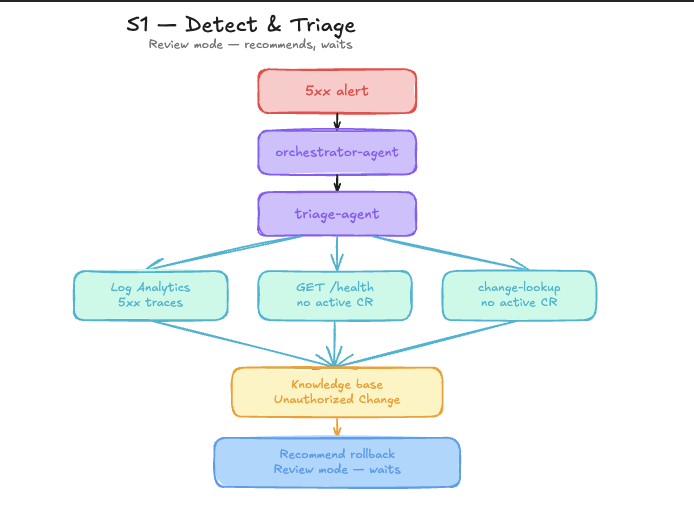

# S1 - Detect and Triage

Persona: On-call / IT Ops

## Story

A developer ships a release straight to production with no change request and no peer review. The image is live and broken. The agent picks up the 5xx alert, finds no active CR, correlates timing with a new rogue revision, matches the Unauthorized Change runbook, and recommends rollback before on-call wakes up.



## Azure SRE Agent Concepts

| Concept | What you see in this scenario |
|---------|-------------------------------|
| **Incident Response Plan** | The pre-configured response plan routes the Azure Monitor `Orders API 5xx` alert to `orchestrator-agent` automatically — no human needed to start the thread |
| **Subagents** | `orchestrator-agent` normalises the alert into an `IncidentContext` and delegates deep investigation to `triage-agent` |
| **Log Analytics connector** | `triage-agent` queries `ContainerAppConsoleLogs_CL` via `QueryLogAnalyticsByWorkspaceId` to find the error spike |
| **Knowledge base (memory)** | Agent searches uploaded runbooks and matches the _Unauthorized Change_ guidance in `change-management-runbook.md` |
| **Access level: Low / Action mode: Review** | Default safe posture — the agent recommends rollback but takes no write action until a human approves |
| **Confidence score** | `triage-agent` returns `"confidence": "high"` only once it correlates the rogue revision + missing CR + error spike |

## Scenario Dependencies

- **Requires:** none — this is the entry point for the lab
- **Unlocks:** S2 (re-run with higher trust to act autonomously), S3 (customer issues reference this incident's CHG numbers), S4 (governance pass uses incident memory from this run)

## Run

```bash
bash scripts/break-app.sh
bash scripts/reset-app.sh
```

## Step by Step

1. `break-app.sh` ships a rogue revision directly to Container Apps with no CR.
2. The `Orders API 5xx` Azure Monitor alert fires within ~1 minute.
3. The Incident Response Plan routes the alert to `orchestrator-agent`.
4. `orchestrator-agent` normalises the alert into an `IncidentContext` (service, symptom, time window, environment).
5. `orchestrator-agent` delegates to `triage-agent` for technical investigation.
6. `triage-agent` searches agent memory for similar past incidents.
7. `triage-agent` queries Log Analytics (`ContainerAppConsoleLogs_CL`) and confirms the 5xx spike.
8. `triage-agent` calls `GET /health` on orders-api and reads `activeChangeRequest: ""` (empty string).
9. `triage-agent` queries `change-lookup /changes/active/now` and confirms no active CR.
10. `triage-agent` searches the knowledge base and matches the Unauthorized Change runbook.
11. `triage-agent` runs `az containerapp revision list` and identifies the rogue revision.
12. `orchestrator-agent` merges findings into a structured incident summary with a rollback recommendation (Review mode — no action taken yet).

## Portal Steps

1. Open [sre.azure.com](https://sre.azure.com) and navigate to your agent.
2. Go to **Incidents** — a new incident thread appears within ~2 minutes of `break-app.sh`.
3. Open the incident thread and watch the agent work through steps 3–12 in real time.
4. Inspect the **Artifacts** panel: KQL query used, metrics snapshot, and revision list output.
5. The final message shows `rollback_recommended: true` with the rogue revision name — no write action was taken.

## Suggested Prompts

After the agent posts its finding, continue the thread to deepen your understanding:

- *"Show me the KQL query you used to find the 5xx spike"*
- *"Which runbook matched and what were the key signals?"*
- *"What would the rollback command look like?"*
- *"Why didn't you take action automatically?"*

## Expected Output

Within 2-3 minutes, the portal incident thread includes:
- The offending rogue revision name
- Evidence of missing CR (`change-lookup` returned no active CR)
- The KQL error trace from Log Analytics
- A structured rollback recommendation in Review mode (no write action taken)

## Validation

```bash
az containerapp revision list -n <orders-api-name> -g <rg> \
  -o table --query "[].{rev:name,active:properties.active,weight:properties.trafficWeight}"
azd env get-value AGENT_PORTAL_URL
```

## Knowledge Base

- [change-management-runbook.md](../knowledge-base/change-management-runbook.md)
- [http-500-errors.md](../knowledge-base/http-500-errors.md)
- [orders-architecture.md](../knowledge-base/orders-architecture.md)
