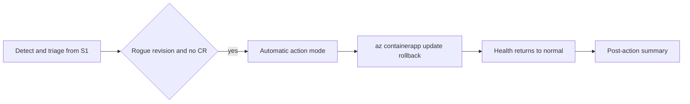

# S2 - Autonomous Remediation

Persona: Platform / SRE

## Story

Same incident as S1, but with higher trust. Once the agent confirms rogue revision plus missing CR, it performs rollback itself and records the action summary.


## Scenario Diagram



## Prerequisite Toggle

Set these in infra/terraform.tfvars and run azd up:

```hcl
access_level = "High"
action_mode  = "Automatic"
```

## Run

```bash
bash scripts/break-app.sh
bash scripts/reset-app.sh
```

## What Changes from S1

1. Detection and triage flow is unchanged.
2. High access grants Contributor on the agent resource group.
3. Automatic mode executes rollback instead of only recommending.
4. Agent posts post-action summary with health state.

## Expected Output

Rogue revision stops taking traffic and health recovers without manual approval.

## Validation

```bash
az containerapp revision list -n <orders-api-name> -g <rg> \
  -o table --query "[].{rev:name,active:properties.active,weight:properties.trafficWeight}"
curl -s "$(azd env get-value ORDERS_API_URL)/health" | jq .
```

## Safety

Default lab mode is Low plus Review. Use High plus Automatic only in a throwaway subscription.