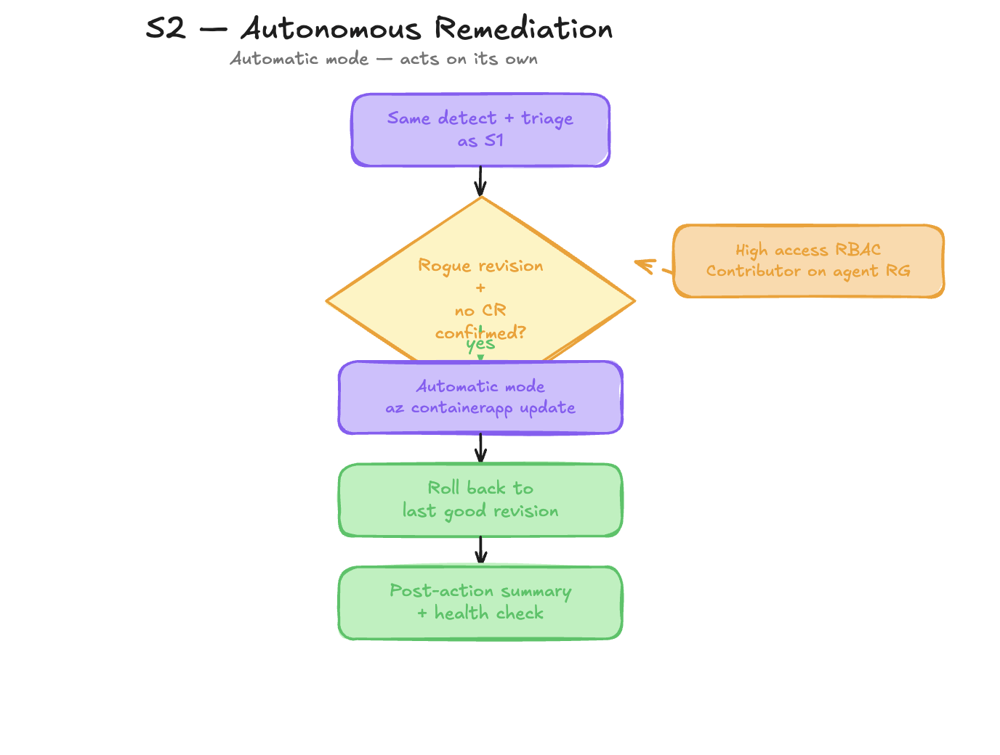

# S2 - Autonomous Remediation

Persona: Platform / SRE

## Story

Same incident as S1, but with higher trust. Once the agent confirms rogue revision plus missing CR, it performs rollback itself and records the action summary. This is the difference between a recommendation engine and a true autonomous SRE agent.



## Azure SRE Agent Concepts

| Concept | What you see in this scenario |
|---------|-------------------------------|
| **Access level: High** | Grants the agent `Contributor` on the resource group, enabling `RunAzCliWriteCommands` in `triage-agent` |
| **Action mode: Automatic** | Agent executes remediation steps without waiting for human approval — contrast with Review mode in S1 |
| **`RunAzCliWriteCommands` tool** | `triage-agent` calls `az containerapp update` to deactivate the rogue revision and restore traffic |
| **Post-action summary** | After rollback, `triage-agent` re-queries `/health` and metrics to confirm recovery, then posts a structured summary |
| **Agent memory (learning)** | The completed remediation — revision name, CR gap, recovery time — is stored in agent memory and influences future investigations |
| **Confidence threshold** | The agent only acts autonomously when `"confidence": "high"` from `triage-agent`; low/medium confidence still produces a recommendation only |

## Scenario Dependencies

- **Requires:** Understand S1 first — S2 runs the identical detection + triage flow, only the trust level differs
- **Unlocks:** S3 (the rollback from this run creates incident context that customer issues reference), S4 (agent memory now contains a completed remediation record)

## Prerequisite Toggle

Set these in `infra/terraform.tfvars` and run `azd up`:

```hcl
access_level = "High"
action_mode  = "Automatic"
```

> **Safety:** Default lab mode is `Low` + `Review`. Only switch to `High` + `Automatic` in a throwaway subscription. The agent will modify live Azure resources.

## Run

```bash
bash scripts/break-app.sh
bash scripts/reset-app.sh
```

## What Changes from S1

| Step | S1 (Review) | S2 (Automatic) |
|------|-------------|----------------|
| Alert ingestion | identical | identical |
| Detection and triage | identical | identical |
| `triage-agent` confidence | high — posts recommendation | high — executes action |
| Write permission | none | `Contributor` on resource group |
| Rollback | recommended, not taken | executed: `az containerapp update` |
| Health re-check | not performed | performed — confirms recovery |
| Post-action summary | not posted | posted with health state + timeline |
| Stored in memory | incident record | incident + remediation record |

## Portal Steps

1. After setting `access_level = "High"` and `action_mode = "Automatic"`, run `azd up` to apply.
2. Run `bash scripts/break-app.sh`.
3. Open [sre.azure.com](https://sre.azure.com) → **Incidents**.
4. Open the incident thread — watch `triage-agent` issue the `az containerapp update` command live.
5. See the traffic weight on the rogue revision drop to 0 in the **Actions** panel.
6. The final message is a post-action summary with health confirmation — no human approval required.

## Suggested Prompts

Ask these in the incident thread after the rollback completes:

- *"What was the exact command you ran to roll back?"*
- *"How did you verify the rollback was successful?"*
- *"What would you have done differently if confidence had been medium?"*
- *"Save this incident to memory so future investigations can reference it"*

## Expected Output

Rogue revision stops taking traffic and health recovers without manual approval. The incident thread ends with a post-action summary containing: rogue revision name, rollback command executed, health status before/after, and time-to-mitigation.

## Validation

```bash
az containerapp revision list -n <orders-api-name> -g <rg> \
  -o table --query "[].{rev:name,active:properties.active,weight:properties.trafficWeight}"
curl -s "$(azd env get-value ORDERS_API_URL)/health" | jq .
```

## Knowledge Base

- [change-management-runbook.md](../knowledge-base/change-management-runbook.md)
- [http-500-errors.md](../knowledge-base/http-500-errors.md)
- [incident-report-template.md](../knowledge-base/incident-report-template.md)
