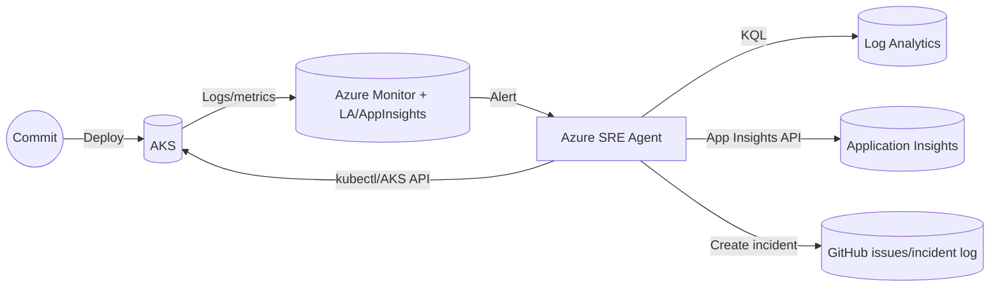

# S3 (AKS) — Change Issue Triage & Auto‑Rollback

Persona: Platform SRE / On‑call
Time to complete: ~15–20 minutes (after S1/S2)
Prerequisite: AKS cluster, Azure Monitor + App Insights wired, SRE Agent deployed (Terraform), optional GitOps (Flux/Argo).

---

## Story
A new deployment hits AKS and 5xx/latency spike. Some pods crashloop, nodes show pressure. Azure Monitor fires; the Azure SRE Agent triages evidence, restarts pods, drains bad nodes if needed, scales where appropriate, and rolls back to a known‑good revision (or reverts the last GitOps commit). Incident is auto‑created with timeline and evidence.

---

## Architecture (high level)


---

## Trigger
- New deployment → within 2–5 minutes: 5xx↑, latency↑, CrashLoopBackOff, node CPU↑.
- Azure Monitor alert → Action Group → Agent HTTP trigger.

---

## Response plan (YAML sketch)
```yaml
name: aks-change-triage-and-rollback
triggers:
  - type: azureMonitor
    filter: Sev0-1-Errors
steps:
  - name: gather-evidence
    run:
      - kql: |
          AppRequests
          | where timestamp > ago(15m)
          | summarize errors=sum(toint(success==false)), p95=percentile(duration,95)
      - kql: |
          KubePodInventory
          | where TimeGenerated > ago(15m)
          | where ContainerStatus =~ 'Terminated' or Reason =~ 'CrashLoopBackOff'
      - aksEvents: { namespace: default }
      - gitopsRecentCommit: true
  - name: detect-regression
    eval:
      compare:
        errorRateDelta: "> 3x"
        p95Delta: "> 2x"
        restartCount: "> 5"
    on_true: remediate
  - name: remediate
    run:
      - kubectl: "rollout restart deployment/orders-api -n default"
      - when: nodePressure
        kubectl: "drain ${node} --ignore-daemonsets --delete-emptydir-data"
      - when: sustainedLoad
        az: "aks nodepool scale --resource-group ${rg} --cluster-name ${aks} --name ${pool} --node-count ${n}"
      - when: regressionPersists
        kubectl: "rollout undo deployment/orders-api -n default"
        # GitOps mode (optional): flux/argo rollback instead of kubectl
  - name: incident
    createIncident:
      include:
        - timeline
        - KQL graphs
        - pod logs
        - node metrics
        - deployment diff
        - actionsTaken
```

---

## Skills invoked (examples)
- Kubernetes Ops: rollout restart/undo, get events, node drain.
- Azure CLI Ops: AKS nodepool scale.
- Observability: KQL against LA + App Insights for error/latency.
- GitOps (optional): Flux/Argo rollback or commit revert.

Example commands the agent executes with Managed Identity:
```bash
kubectl rollout restart deployment orders-api -n default
kubectl drain <node> --ignore-daemonsets --delete-emptydir-data
az aks nodepool scale -g <rg> -n <pool> --cluster-name <aks> --node-count 4
kubectl rollout undo deployment orders-api -n default
```

---

## Terraform references
Use the included module under `infra/terraform`:
- Log Analytics + App Insights: `main.tf`
- SRE Agent resource: `sreagent.tf` (azapi `Microsoft.App/agents@2025-05-01-preview`)
- RBAC least‑privilege + admin role: `rbac.tf`
- Outputs: agent endpoint, MI id: `output.tf`

Inputs to set per environment:
```hcl
variable "agent_name" {}
variable "resource_group_name" {}
variable "location" { default = "uksouth" }
variable "target_resource_groups" { default = ["app-rg"] }
variable "action_mode" { default = "Review" } # use "Automatic" after confidence
```

---

## Run
1) Deploy/scale a bad revision (e.g., raise error rate).
2) Azure Monitor alert fires → agent plan runs.
3) Agent gathers evidence, restarts pods, drains nodes if needed, and either stabilizes or rolls back.

---

## Validation
- Error rate drops to baseline; pods healthy; no node pressure.
- `kubectl rollout history deployment/orders-api -n default` shows undo when applied.
- Incident record includes timeline, graphs, logs, diff, and actions taken.

---

## Knowledge base
- [http-500-errors.md](../knowledge-base/http-500-errors.md)
- On‑call handoff template: [on-call-handoff.md](../knowledge-base/on-call-handoff.md)
- Incident report template: [incident-report.md](../knowledge-base/incident-report.md)
```