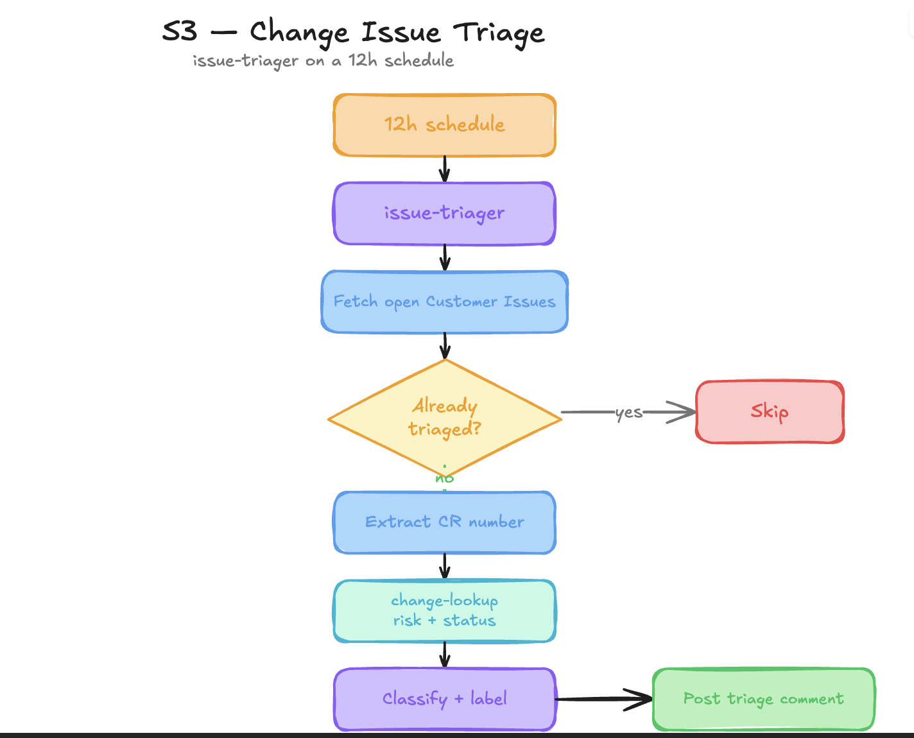

# S3 - Change Issue Triage

Persona: Support / Automation

## Story

The morning after S2, customer issues flood GitHub. The issue-triager runs on schedule, extracts CR numbers, looks them up in change-lookup, classifies issues, applies labels, and posts structured triage comments.

  

## Scenario Diagram

## Run

```bash
bash scripts/create-sample-issues.sh OWNER/REPO
```

Sample issues created:

- orders-api 500s spiked after CHG0030001 last night
- Checkout intermittently failing, possibly related to CHG0030002
- Deploy without a linked CR got through, paved road issue
- Who owns change-management-runbook.md?

## Expected Output

Within one schedule cycle, each customer issue has a bot triage comment with classification, linked CR, risk context, and summary text.

## Validation

```bash
gh issue list -R OWNER/REPO --search '"[Customer Issue]"' --json number,labels
gh issue view <number> -R OWNER/REPO --comments | grep -i 'SRE Agent'
```

## Knowledge Base

- [github-issue-triage.md](../knowledge-base/github-issue-triage.md)
- [change-management-runbook.md](../knowledge-base/change-management-runbook.md)