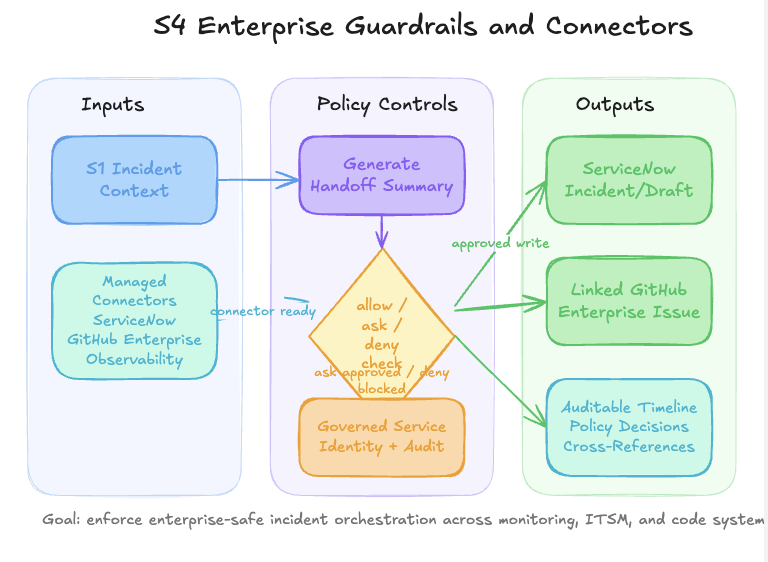

# S4 - Enterprise Guardrails and Connectors at Scale

Persona: Platform Engineering / ITSM Owners

## Story

After S1 (and optionally S2), the platform team needs proof that agent operations are enterprise-safe. This scenario validates end-to-end governance: managed connectors for ServiceNow, GitHub Enterprise, and observability, tool permissions (allow/ask/deny), and governed identity for work-item creation. The outcome is a repeatable pattern for secure production adoption, not just incident handling.



## Azure SRE Agent Concepts

| Concept | What you see in this scenario |
|---------|-------------------------------|
| **Managed connectors** | ServiceNow, GitHub Enterprise, and observability connectors are configured centrally and reused by teams |
| **Granular permissions** | Tool-level allow/ask/deny policies are enforced during triage and handoff actions |
| **Governed identity** | Incident-to-work-item handoff runs under approved service identity, preserving auditability |
| **Cross-system orchestration** | One incident context is propagated across monitoring, ITSM, and code systems |
| **Policy-aware execution** | If a tool is deny-listed or requires ask approval, the agent pauses and surfaces the policy decision |
| **Enterprise operating model** | Demonstrates how incident automation can scale without bypassing security and platform controls |

## Scenario Dependencies

- **Requires:** Run S1 first so this scenario starts from a real incident thread and evidence set
- **Recommended:** Run S3 before S4 so issue classification and labels can be compared against ServiceNow categorization
- **Optional:** Run S2 to include autonomous rollback artifacts in the governed handoff narrative
- **Unlocks:** S5 (optional chaos validation) with policy-aware incident response in a non-production environment

## Control Areas Evaluated

| # | Control area | What to verify |
|---|--------------|----------------|
| 1 | Connector governance | ServiceNow, GitHub Enterprise, and observability connectors are provisioned through managed connector policy |
| 2 | Tool permission policy | Critical write tools use ask/deny as expected while low-risk read tools remain allow |
| 3 | Incident handoff integrity | Incident summary fields map consistently into created ticket or work item |
| 4 | Identity and audit trail | Actions are attributed to governed service identity with timestamped action history |
| 5 | Approval experience | Approval checkpoints are explicit, minimal, and visible to operators in-thread |
| 6 | Catalog controls | Only approved internal skills/plugins are available for this run |

## Run

```bash
# Run S1 first to create an incident baseline, then use the same thread evidence for S4.
bash scripts/break-app.sh
```

Then open a new chat thread on [sre.azure.com](https://sre.azure.com) and trigger the enterprise controls walkthrough with one of the prompts below.

## Step by Step

1. Open the S1 incident thread and capture its summary artifacts (symptom, impact, suspected cause, timeline).
2. Confirm managed connectors for ServiceNow, GitHub Enterprise, and observability are available to the agent.
3. Ask the agent to produce a handoff summary suitable for ticket creation.
4. Trigger a ticket/work-item creation step and observe tool permission behavior.
5. Approve ask-gated actions when prompted; confirm deny-listed actions are blocked.
6. Verify ticket/work-item fields match incident context and classification.
7. Request a follow-up engineering issue in GitHub Enterprise linked to the same incident ID.
8. Validate both records include cross-references and owner/priority consistency.
9. Review the action history for identity attribution and policy decisions.

## Portal Steps

1. Open [sre.azure.com](https://sre.azure.com) and navigate to your agent.
2. Open the incident generated by S1 from **Incidents**.
3. Start a new thread for governance and connector validation.
4. Ask for ServiceNow handoff creation from the incident evidence.
5. Confirm policy prompts appear for ask-gated tools.
6. Open created records in ServiceNow and GitHub Enterprise to verify linkage and data quality.

## Suggested Prompts

- *"Using the S1 incident context, create a ServiceNow incident draft with impact, urgency, and suspected change correlation"*
- *"Show which tools are allow, ask, and deny for this thread before you execute any write action"*
- *"Create the linked GitHub Enterprise issue for engineering follow-up and include the ServiceNow ticket reference"*
- *"List every policy gate encountered and whether it was approved, denied, or skipped"*
- *"Summarize connector usage and provide an auditable action timeline"*

## Expected Output

The scenario should produce:
- A ServiceNow incident or draft with fields populated from S1 evidence
- A linked GitHub Enterprise issue for engineering follow-up
- A clear log of allow/ask/deny decisions made during execution
- End-to-end cross-reference IDs between incident thread, ServiceNow, and GitHub
- An auditable timeline showing identity, action, and policy outcome

## Validation

```bash
# Verify S1 baseline incident exists
azd env get-value AGENT_PORTAL_URL

# Optional: validate linked engineering issue was created
gh issue list -R OWNER/REPO --search 'SRE incident' --state open
```

## Knowledge Base

- [github-issue-triage.md](../knowledge-base/github-issue-triage.md)
- [change-management-runbook.md](../knowledge-base/change-management-runbook.md)
- [on-call-handoff.md](../knowledge-base/on-call-handoff.md)
- [orders-architecture.md](../knowledge-base/orders-architecture.md)
