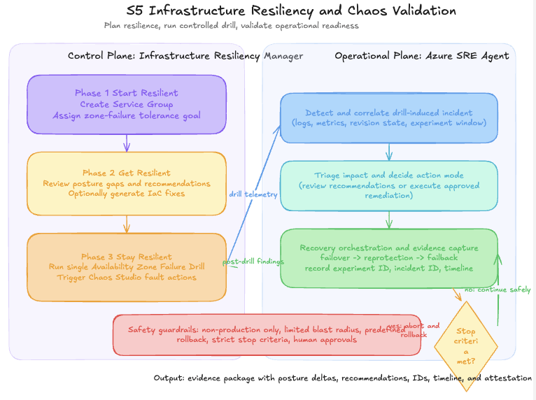

# S5 — Infrastructure Resiliency & Chaos Validation (Optional)

**Persona:** Platform Engineering / Reliability Engineering
**Time to complete:** ~30–60 minutes (after S1–S4)
**Prerequisites:** [S1](./scenario-s1-detect-triage.md) baseline and alerting must be functional. [S2](./scenario-s2-autonomous-remediation.md) and [S4](./scenario-s4-enterprise%20guardrails%20and%20connectors.md) are recommended.

---

## Story

After S1–S4, the team needs measurable resilience evidence, not just incident response. Azure Infrastructure Resiliency Manager (public preview) defines scope and goals, surfaces recommendations, and runs Availability Zone Failure Drills through Chaos Studio. Azure SRE Agent handles the operational side by detecting drill-triggered incidents, triaging impact, and guiding safe remediation.

The drill is intentionally controlled: limited blast radius, predefined rollback, strict stop criteria, and human approval gates.

---




> **Safety requirements — read before running**
>
> - Run **only in non-production subscriptions**.
> - Use a **dedicated drill resource group** (or tagged target set) to constrain blast radius.
> - Start with **one fault at a time** and short drill windows.
> - **Define rollback before each run** (`bash scripts/reset-app.sh`).
> - Set **explicit abort criteria** (e.g. sustained Sev1 or customer-impacting error rate).
> - Run with **on-call visibility** and a named owner for the experiment window.

---

## Azure Infrastructure Resiliency Manager Concepts

| Concept | What you see in this scenario |
|---------|-------------------------------|
| **Service Groups** | Resources grouped by application boundary (across resource groups or by tag) to define drill scope |
| **Goal-Driven Resiliency Posture** | A zone-failure tolerance goal is assigned to the Service Group — the dashboard shows compliant vs. at-risk resources |
| **Resiliency Agent** | Embedded AI assistant that analyzes posture gaps, recommends specific fixes, and generates IaC (ARM, Bicep, or Terraform) |
| **Actionable Recommendations** | Advisor-powered guidance with implementation steps, cost indicators, and impacted resource details |
| **Availability Zone Failure Drill** | Chaos Studio-backed simulation: shuts down VMs in a target zone, forces database failover, stops AKS node pools |
| **Recovery Orchestration** | Full-cycle simulation: fault injection → failover → reprotection → failback |
| **Real-Time Health Monitoring** | Azure Monitor dashboard tracks resource health during the drill; results and attestations logged for compliance |

---

## Azure SRE Agent Concepts

| Concept | What you see in this scenario |
|---------|-------------------------------|
| **Evidence-driven incident handling** | SRE Agent correlates the drill window with logs, metrics, and active revision state to distinguish drill faults from real incidents |
| **Confidence and action mode** | Review mode: agent recommends actions. Automatic mode: agent can execute approved remediation |
| **Operational guardrails** | Drill boundaries are validated before and after experiment execution |
| **Cross-system traceability** | Experiment run ID and incident IDs are captured together for postmortem evidence |

---

## Scenario Map

| Relationship | Scenario |
|-------------|----------|
| **Required** | [S1](./scenario-s1-detect-triage.md) — baseline setup and incident alerting must be functional |
| **Recommended** | [S2](./scenario-s2-autonomous-remediation.md) and [S4](./scenario-s4-enterprise%20guardrails%20and%20connectors.md) — response posture and governance controls validated |
| **Optional** | [S3](./scenario-s3-change-issue-triage.md) — downstream issue-triage evidence from drill-generated incidents |

---

## Three-Phase Journey

| Phase | Goal | What happens |
|-------|------|-------------|
| **1 — Start Resilient** | Define scope | Create Service Group and assign zone-failure tolerance goal |
| **2 — Get Resilient** | Address gaps | Review posture gaps and Resiliency Agent recommendations; optionally generate IaC fixes |
| **3 — Stay Resilient** | Run the drill | Execute Availability Zone Failure Drill and observe SRE Agent triage and recovery |

---

## Run

```bash
# Pre-check: confirm non-production context before any chaos run
az account show --query "{name:name, id:id, tenantId:tenantId}" -o table

# Verify agent portal target
azd env get-value AGENT_PORTAL_URL

# Baseline health before drill
curl -s "$(azd env get-value ORDERS_API_URL)/health" | jq .

# Prepare rollback — validate it works before starting the drill
bash scripts/reset-app.sh
```

---

## Step by Step

### Phase 1 — Start Resilient

1. Open Infrastructure Resiliency Manager in the Azure portal.
2. Create a **Service Group** scoped to the orders-api resource group (or use tag-based targeting).
3. Assign a **zone-failure tolerance goal** to the Service Group.
4. Review the posture dashboard — identify which resources are compliant vs. at risk.

### Phase 2 — Get Resilient

5. Open the **Resiliency Agent** and ask it to analyze posture gaps for the Service Group.
6. Review **Actionable Recommendations** (Advisor-powered) — note cost indicators and impacted resources.
7. Optionally request IaC output (Bicep or Terraform) from the Resiliency Agent to address a gap.

### Phase 3 — Stay Resilient (Drill)

8. Confirm you are in a non-production subscription and the intended resource group.
9. Capture baseline health, error rate, and latency before the drill starts.
10. Start one **Availability Zone Failure Drill** targeting a single zone with a short duration.
11. Infrastructure Resiliency Manager triggers Chaos Studio fault actions automatically (VM shutdown, DB failover, AKS node pool stop) based on resource type.
12. Observe the **Real-Time Health Monitoring** dashboard in Azure Monitor.
13. Watch the SRE Agent detect the drill-generated incident and triage it in the agent portal.
14. If stop criteria are hit, abort the drill immediately and run rollback.
15. After completion, observe **Recovery Orchestration** (failback sequence) and validate recovery.
16. Capture experiment run ID, incident ID, and timeline for postmortem evidence.

---

## Suggested Fault Progression

Start low-risk and escalate only when the previous level is well understood:

1. **Low risk:** Increase HTTP latency briefly — no zone impact.
2. **Medium risk:** Single Availability Zone Failure Drill — VM shutdown only, short window.
3. **Higher risk:** Full Recovery Orchestration cycle — fault injection → failover → reprotection → failback.

Run only one fault type per session.

---

## Abort and Rollback Guardrails

Stop the drill immediately if any of these conditions are true:

- Sev1 impact is detected
- Error rate exceeds your approved threshold for more than the allowed window
- Customer-facing checkout path is unavailable
- Agent recommendations conflict with policy constraints

Rollback sequence:

1. Abort the drill in Infrastructure Resiliency Manager or Chaos Studio.
2. Restore service: `bash scripts/reset-app.sh`
3. Re-check `GET /health`, active revision, and alert state.
4. Capture final verification artifacts in incident notes.

---

## Portal Steps

1. Open Infrastructure Resiliency Manager → confirm Service Group and goal are configured.
2. Review posture insights and chat with the Resiliency Agent for gap analysis.
3. Start the Availability Zone Failure Drill — observe the real-time health dashboard.
4. Open [sre.azure.com](https://sre.azure.com) → **Incidents** — watch the SRE Agent triage the drill-generated incident.
5. After recovery, open the drill history in Infrastructure Resiliency Manager to view the attestation log.

---

## Suggested Prompts

- *"Correlate the current incident with the active chaos experiment window and summarize blast radius"*
- *"Summarize this Service Group's resiliency goal and current posture gaps before we run the drill"*
- *"What signals indicate this is drill-induced versus an unauthorized production change?"*
- *"Show the safest rollback command and explain why it is low risk"*
- *"List stop criteria status and tell me whether to continue or abort"*

---

## Expected Output

- Posture dashboard showing Service Group goal compliance before and after the drill
- Resiliency Agent recommendations with IaC output for at least one gap
- Incident thread in the SRE Agent portal that references fault timing and affected component(s)
- Recovery Orchestration completion log (failover → reprotection → failback)
- Post-run evidence package: experiment run ID, incident ID, timeline, attestation log, and validation checks

---

## Validation

```bash
# Validate API health after rollback
curl -s "$(azd env get-value ORDERS_API_URL)/health" | jq .

# Validate active revision traffic state
az containerapp revision list -n <orders-api-name> -g <rg> \
  -o table --query "[].{rev:name,active:properties.active,weight:properties.trafficWeight}"
```

---

## Knowledge Base

- [http-500-errors.md](../knowledge-base/http-500-errors.md)
- [change-management-runbook.md](../knowledge-base/change-management-runbook.md)
- [incident-report-template.md](../knowledge-base/incident-report-template.md)
- [on-call-handoff.md](../knowledge-base/on-call-handoff.md)
