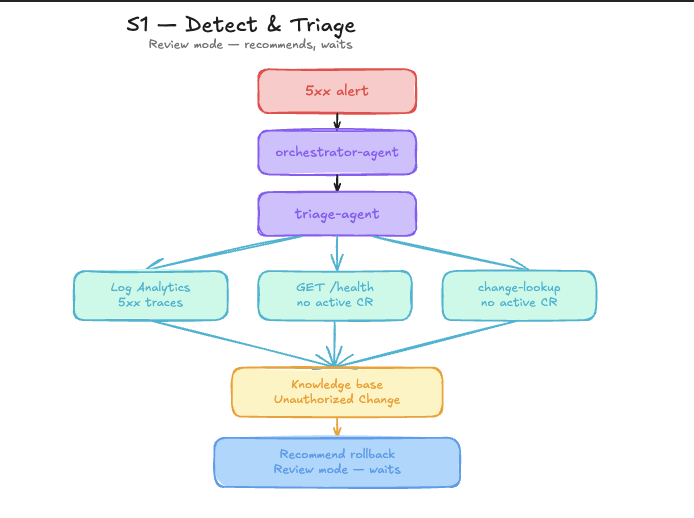

# S1 — Incident Detection & Triage

**Persona:** Platform Engineering / On-call
**Time to complete:** ~15 minutes
**Entry point:** This is the starting scenario — run it first.

---

## Story

A platform engineer ships a change to a shared production workload without the usual guardrails — no change request, no peer review, and no rollout validation. The service is live and broken. The Azure Monitor alert fires automatically — the agent picks it up, triages the severity, queries Log Analytics for 5xx error patterns, correlates with Azure Monitor metrics and deployment history, pinpoints the root cause at the source file level, submits a fix PR, and resolves the alert — all before on-call wakes up. The session is saved so the next similar platform incident is handled faster.



---

## How the Agent Handles It

| Step | What happens |
|------|-------------|
| **Alert fires** | Agent picks up the Azure Monitor alert automatically via Incident Response Plan — no human trigger needed |
| **Triage** | Classifies severity, identifies the affected platform workload, plans investigation |
| **Log Analytics** | Runs KQL queries — 5xx counts, error patterns, spike timing |
| **Azure Monitor** | Correlates with platform metrics, traces, and deployment history |
| **Source search** | Finds the root cause at `file:line` level in the platform repo |
| **Fix PR + alert resolve** | Submits PR with proposed code change, resolves the incident |
| **Session insights** | Findings saved — next similar incident skips re-discovery |

---

## Key Concepts

| Concept | What you see in this scenario |
|---------|-------------------------------|
| **Incident Response Plan** | Routes the `Orders API 5xx spike` alert to `orchestrator-agent` |
| **Subagents** | `orchestrator-agent` delegates the investigation to `triage-agent` |
| **Log Analytics connector** | `triage-agent` queries app logs and traces for the spike |
| **Azure Monitor metrics** | Agent correlates the spike with CPU, latency, and rollout timing |
| **Knowledge base** | Agent matches the _Unauthorized Change_ guidance |
| **Source code search** | Agent finds the root cause at file level |
| **PR creation** | Agent submits a fix PR for review |
| **Alert resolution** | Agent resolves the alert after the fix is proposed |
| **Session insights** | Findings are saved for next time |

---

## Scenario Map

| Relationship | Scenario |
|-------------|----------|
| **Prerequisites** | None — this is the entry point |
| **Unlocks** | [S2](./scenario-s2-autonomous-remediation.md) — break the running app at runtime and watch the agent remediate |
| **Unlocks** | [S3](./scenario-s3-change-issue-triage.md) — customer issues reference this incident's CHG numbers |
| **Unlocks** | [S4](../s4-alert-response-incident-operations/README.md) — alert response uses this incident as a realistic alert and telemetry baseline |

---

## Run

```bash
bash scripts/break-app.sh
```

To restore afterward:

```bash
# If runtime 5xx simulation mode was used
APP_URL="$(cd infra/terraform && terraform output -raw orders_api_url)"
curl -X POST "$APP_URL/api/simulate/reset"
curl -X POST "$APP_URL/api/simulate/clear-cr"

# If fallback image-break mode was used, restore a working image
az containerapp update -g <rg> -n orders-api --image <working-image>
```

---

## Step by Step

1. The `break-app.sh` script is no longer available (chaos monkey support has been removed).
2. A platform change introduces a regression in the production workload.
3. The `Orders API 5xx spike` Azure Monitor alert evaluates on a 5 minute window and typically appears within a few minutes.
4. The Incident Response Plan routes the alert to `orchestrator-agent`.
5. `orchestrator-agent` normalizes the alert into an `IncidentContext` (service, symptom, time window, environment) and classifies severity.
6. `orchestrator-agent` delegates to `triage-agent` for technical investigation.
7. `triage-agent` queries Log Analytics / Application Insights request data for the `5xx` spike and error patterns.
8. `triage-agent` queries Azure Monitor metrics — CPU, memory, latency, and deployment history — and correlates timing with the rogue revision or simulated change window.
9. If the app is reachable, `triage-agent` calls `GET /health` on orders-api and inspects `activeChangeRequest`.
10. `triage-agent` checks the available change record source and confirms whether there was an active CR.
11. `triage-agent` searches the knowledge base and matches the Unauthorized Change runbook.
12. `triage-agent` runs `az containerapp revision list` and identifies the rogue revision.
13. `triage-agent` searches the source repository and identifies the root cause at `file:line` level.
14. `orchestrator-agent` submits a fix PR with the proposed code change.
15. `orchestrator-agent` resolves the Azure Monitor alert and posts a structured incident summary.
16. Session insights are saved — the root cause, KQL queries, and fix pattern are stored for future incidents.

---

## Portal Steps

1. Open [sre.azure.com](https://sre.azure.com) and navigate to your agent.
2. Go to **Incidents** — a new incident thread should appear after the alert evaluation window completes, typically within ~5 to 10 minutes of running `break-app.sh`.
3. Open the incident thread and watch the agent work through steps 3–15 in real time.
4. Inspect the **Artifacts** panel: KQL query used, metrics snapshot, revision list output, and source file reference.
5. The final message shows the fix PR link, the resolved alert, and the saved session insight.

---

## Suggested Prompts

After the agent posts its findings, continue the thread to go deeper:

- *"Show me the KQL query you used to find the 5xx spike"*
- *"Which runbook matched and what were the key signals?"*
- *"What was the root cause at the source level?"*
- *"Why did you create a PR instead of deploying directly?"*
- *"What did you save for next time?"*

---

## Expected Output

After the alert window completes, the portal incident thread includes:

- The offending rogue revision name
- Evidence of missing CR (no active change record was found)
- The KQL error trace and Azure Monitor metrics correlation
- The root cause file and line number in the repository
- A submitted fix PR link
- The Azure Monitor alert marked as resolved
- A session insight entry for future incidents

---

## Validation

```bash
az containerapp revision list -n <orders-api-name> -g <rg> \
  -o table --query "[].{rev:name,active:properties.active,weight:properties.trafficWeight}"

azd env get-value AGENT_PORTAL_URL
```

---

## Knowledge Base

- [change-management-runbook.md](../knowledge-base/change-management-runbook.md)
- [http-500-errors.md](../knowledge-base/http-500-errors.md)
- [orders-architecture.md](../knowledge-base/orders-architecture.md)
