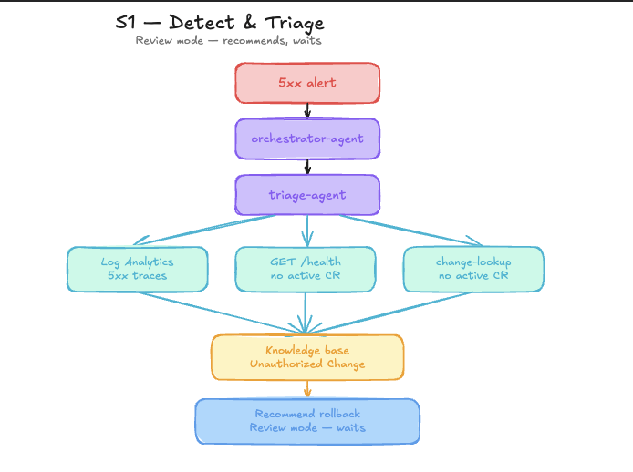

# S1 — Incident Detection & Triage

**Persona:** Platform Engineering / On-call  
**Time:** ~15 minutes  
**Entry point:** Start here (foundation for S2–S6)  
**Recipe:** `azmon-lawappinsights`

---

## ⚡ Quick Start: 5-Minute Lab

### Prerequisites & Setup
```bash
# 1. Copy and customize terraform.tfvars
cp recipes/azmon-lawappinsights/terraform/terraform.tfvars.example \
   infra/terraform/terraform.tfvars

# 2. Edit terraform.tfvars with your values:
# - resource_group_name = "s1-demo-rg"
# - location = "uksouth" (or your region)
# - agent_name = "s1-agent"
# - action_mode = "Review" (use "Automatic" after testing)
```

### Deploy & Observe (5 mins)
```bash
# Deploy infrastructure + SRE Agent
terraform -chdir=infra/terraform apply -auto-approve

# Register incident automations
bash scripts/apply-extras.sh s1

# Trigger incident: inject 5xx error spike
bash scripts/break-app.sh

# Watch it:
# - Azure Monitor alert fires (30–60 sec)
# - SRE Agent investigates via KQL
# - Root cause identified at file:line level
# - PR submitted automatically to fix
# - Incident resolved
```

---

## Story

A platform engineer ships a change without guardrails—no peer review, no rollout validation. The service breaks immediately. The Azure Monitor alert fires automatically. The SRE Agent picks it up, triages severity, queries Log Analytics for 5xx patterns, correlates with deployment history, pinpoints the root cause at the source file level, submits a fix PR, and resolves the alert—all before on-call wakes up.

---

## How It Works

1. **Alert fires** → Azure Monitor detects 5xx spike automatically
2. **Agent investigates** → Runs KQL queries against Log Analytics
3. **Root cause found** → Correlates spike with recent deployment/code change
4. **Fix proposed** → Submits PR with code correction
5. **Alert resolves** → Agent confirms incident is fixed

---

## Architecture



---

## VNet Integration: Reach a Private Key Vault (~5 mins)

S1 VNet-integrates the agent by default (`SRE_ENABLE_VNET=true`) and deploys a Key Vault with **public access disabled**, reachable only through a private endpoint. The agent can reach it only because its sandbox egresses through the VNet and resolves the vault through the linked `privatelink.vaultcore.azure.net` zone.

Ask the agent in chat:

```text
Use Python to resolve <SRE_PRIVATE_KEY_VAULT_NAME>.vault.azure.net and tell me whether it
is a private or public IP. Then read the orders-db-connection secret from that vault.
```

- ✅ Resolves to `10.30.0.x` via the `privatelink` CNAME → private path works.
- ❌ Resolves to a public IP → the DNS zone link or VNet injection is missing; the vault refuses the call.

Get the vault name with `azd env get-value SRE_PRIVATE_KEY_VAULT_NAME`. Package registries (PyPI, npm), GitHub and remote MCP stay on the agent's managed path, so the VNet needs no NAT gateway or firewall.

**Cost:** the VNet and agent injection are free; the private endpoint (~$7.30/month) and DNS zone (~$0.50/month) are the only additions. Skip it with `azd env set SRE_ENABLE_VNET false`. Use `azd down --purge` so the soft-deleted vault doesn't block the next deploy.

---

## Validation Checklist

After the quick start:
- ✅ Azure Monitor alert fires (check Alerts page in portal)
- ✅ SRE Agent investigates automatically
- ✅ PR appears in GitHub repo with fix proposal
- ✅ Error rate shown in Log Analytics
- ✅ Alert resolves when fix is applied
- ✅ Incident record saved for pattern matching
- ✅ Agent resolves the private Key Vault to a `10.30.0.x` address

---

## Cleanup

```bash
# Restore the app
APP_URL="$(cd infra/terraform && terraform output -raw orders_api_url)"
curl -X POST "$APP_URL/api/simulate/reset"
```

---

## Next: What Comes After S1

- **S2 — Autonomous Remediation**: Break the app at runtime (no code/infrastructure changes)
- **S3 — AKS Root Cause**: High-severity Azure Monitor incidents + Kubernetes investigation
- **S4 — Alert Response**: Operator-ready monitoring and incident creation workflows

---

## Knowledge Base

- [change-management-runbook.md](../../knowledge-base/change-management-runbook.md)
- [http-500-errors.md](../../knowledge-base/http-500-errors.md)
- [orders-architecture.md](../../knowledge-base/orders-architecture.md)
