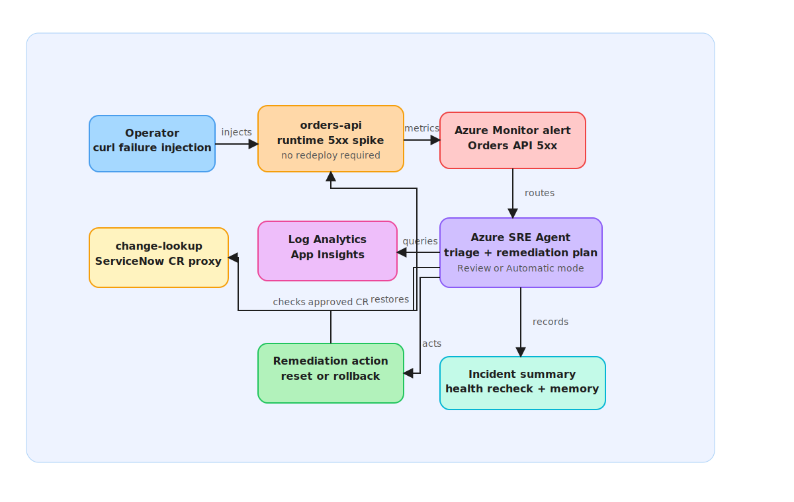

# S2 — Autonomous Remediation (Runtime Scenario)

**Persona:** Platform / SRE
**Time to complete:** ~10 minutes (after S1)
**Prerequisite:** Deploy the `sbox` Terraform environment and run `bash scripts/apply-extras.sh sbox` so the S2 skills, subagents, telemetry connectors, and incident response plans are registered.

---

## Story

This is the fun part of the lab. You break the running app with a single `curl`,
then watch the SRE Agent do the rest — **detect** the 5xx spike, **investigate**
the root cause, **propose** a remediation, and **optionally fix it** for you.

No `terraform.tfvars` edits. No `azd up`. No connector wiring. It's a pure
**runtime** scenario against the already-deployed `orders-api`: you inject a
failure at runtime and observe the agent end to end.



---

## Where S2 sits

S2 is **runtime only** after the `sbox` environment is provisioned — it changes nothing about your infrastructure or config while you run the scenario.

| Stage | What it is | Tooling |
|-------|------------|---------|
| **S1** | Base infrastructure | Bicep + azd |
| **S2** | **This scenario — break it and watch** | `sbox.tfvars` + `bash scripts/apply-extras.sh sbox`, then runtime trigger (`curl`) |
| **S3** | Agent / app configuration | Terraform |
| **S4** | Day-2 operations | Terraform |

---

## Key Concepts

| Concept | What you see in this scenario |
|---------|-------------------------------|
| **Runtime failure injection** | `POST /api/simulate/failure-rate/{percent}` makes `orders-api` return 5xx without redeploying anything |
| **Unauthorized change signal** | Clearing the active CR (`/api/simulate/clear-cr`) makes the failure look like a rogue, un-reviewed change |
| **ServiceNow CR check (`change-lookup`)** | The agent queries [`change-lookup`](../../src/change-lookup/README.md) — the lab's ServiceNow `change_request` proxy — and finds the failing revision maps to **no approved CR**, confirming it's unauthorized |
| **Detect → investigate → propose** | The agent picks up the Azure Monitor alert, queries logs/metrics, and pinpoints the root cause |
| **Optional autonomous fix** | In **Review** mode you approve the proposed remediation in the portal; if the agent was provisioned **High + Automatic** (S3/S4) it executes the rollback itself |
| **Post-action summary** | After remediation the agent re-checks `/health` and metrics to confirm recovery |
| **Agent memory** | The completed incident — symptom, root cause, recovery time — is stored and speeds up future investigations |

---

## Scenario Map

| Relationship | Scenario |
|-------------|----------|
| **Prerequisites** | [S1](./scenario-s1-detect-triage.md) — platform deployed, agent configured |
| **Unlocks** | [S3](./scenario-s3-change-issue-triage.md) — this incident becomes context customer issues reference |
| **Unlocks** | [S4](../s4-alert-response-incident-operations/README.md) — post-remediation evidence can be reused to validate monitoring recovery and incident updates |

---

## Setup

Deploy and register the S2 environment, then grab the running app's URL. For another environment such as `prod`, use matching files at `environments/prod.tfvars` and `backend/prod.backend.tfvars`, keep the S2-required App Insights, Log Analytics, Azure Monitor, and Sev0/Sev1 incident-filter toggles enabled, and replace `sbox` with `prod` in the commands:

```bash
terraform -chdir=infra/terraform init -reconfigure -backend-config=backend/sbox.backend.tfvars
terraform -chdir=infra/terraform apply -var-file=environments/sbox.tfvars
bash scripts/apply-extras.sh sbox

APP_URL="$(cd infra/terraform && terraform output -raw orders_api_url)"
# or, if you prefer azd:
# APP_URL="$(azd env get-value ORDERS_API_URL)"

curl -s "$APP_URL/health" | jq .   # confirm it's healthy first
```

---

## Run

Break the app at runtime — a high failure rate with **no active CR** looks like an
unauthorized change shipped straight to production:

```bash
# 1. Make sure no legitimate change window is announced
curl -X POST "$APP_URL/api/simulate/clear-cr"

# 2. Inject failures — orders-api now returns 5xx for most requests
curl -X POST "$APP_URL/api/simulate/failure-rate/80"
```

The `Orders API 5xx` Azure Monitor alert evaluates on a ~5-minute window. Within a
few minutes an incident thread appears in the portal — then sit back and watch.

When you're done, restore the app:

```bash
curl -X POST "$APP_URL/api/simulate/reset"      # failure rate back to 0
curl -X POST "$APP_URL/api/simulate/clear-cr"   # leave CR state clean
```

---

## What You'll Watch the Agent Do

| Phase | What happens |
|-------|--------------|
| **Detect** | Azure Monitor alert fires; the Incident Response Plan routes it to the agent — no human trigger |
| **Triage** | Agent classifies severity, identifies `orders-api`, plans the investigation |
| **Investigate** | Queries Log Analytics for the 5xx pattern, correlates with metrics and deployment history, checks `/health`, and calls `change-lookup` (the ServiceNow CR proxy) to see if an approved change covers the failing revision |
| **Root cause** | Matches the _Unauthorized Change_ runbook — 5xx spike with **no approved ServiceNow CR** in `change-lookup` |
| **Propose** | Posts a remediation recommendation (rollback / restore healthy state) with confidence |
| **Optionally fix** | **Review** mode: you approve in the portal. **Automatic** mode: agent executes the rollback itself |
| **Confirm** | Agent re-queries `/health` and metrics, posts a post-action summary, stores the incident in memory |

---

## Portal Steps

1. Run the two `curl` commands in **Run** above.
2. Open [sre.azure.com](https://sre.azure.com) → **Incidents**.
3. Wait for the new incident thread (typically ~5–10 minutes after injecting failures).
4. Follow the agent live as it triages, queries logs/metrics, and identifies the root cause.
5. When the agent proposes a remediation:
   - **Review mode** → click **Approve** to let it act.
   - **Automatic mode** → it has already acted; watch the **Actions** panel.
6. The thread ends with a post-action summary confirming health recovery.
7. Run the **reset** commands to restore the app.

---

## Suggested Prompts

In the incident thread, ask the agent:

- *"What was the root cause, and how did you confirm it?"*
- *"Was there an approved ServiceNow change request for this deployment?"*
- *"What remediation do you recommend, and why?"*
- *"How will you verify the fix worked?"*
- *"Save this incident to memory so future investigations can reference it."*

---

## Expected Output

The 5xx spike subsides once the failure injection is remediated (by you approving,
the agent acting, or your `reset`), and `/health` recovers. The incident thread ends
with a post-action summary containing:

- Affected service and symptom
- Identified root cause
- Remediation taken (proposed or executed)
- Health status before and after

---

## Validation

```bash
# Failure injection cleared and app healthy again
curl -s "$APP_URL/health" | jq .

# If a revision rollback was performed, confirm traffic weights
az containerapp revision list -n <orders-api-name> -g <rg> \
  -o table --query "[].{rev:name,active:properties.active,weight:properties.trafficWeight}"
```

---

## Knowledge Base

- [http-500-errors.md](../../knowledge-base/http-500-errors.md)
- [orders-architecture.md](../../knowledge-base/orders-architecture.md)
- [incident-report.md](../../knowledge-base/incident-report.md)
