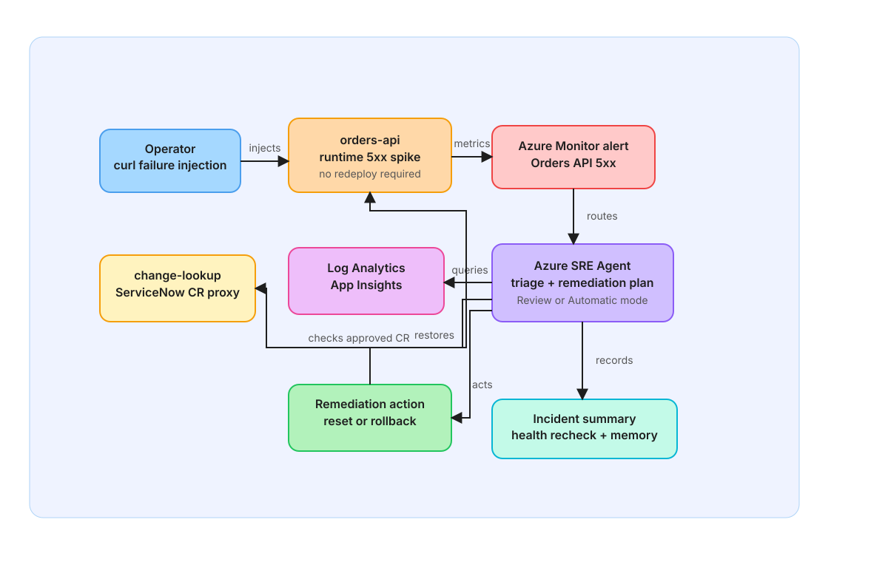

# S2 — App Service Autonomous Remediation

**Persona:** Platform Engineering / On-call

**Runtime:** Azure App Service (`sbox`)

**Recipe:** `azmon-lawappinsights`

---

## Quick Start

### Prerequisites & Setup

- Sign in to Azure CLI and GitHub CLI; have GitHub Copilot CLI available.
- Configure the [deployment workflow](../../.github/workflows/deploy.yml) and its Azure credentials.
- Use `infra/terraform/environments/sbox.tfvars`: `scenario = "s2"`,
  `access_level = "High"`, `action_mode = "Autonomous"`, and the Application
  Insights, Log Analytics, and Sev0/Sev1 incident options enabled.

> **Caution:** The chaos toggle intentionally crashes the `orders-api` worker.
> Use only `rg-sre-lab-sbox`, never a production app. This lab does not deploy a
> dashboard: the App Service root returns service metadata.

### Deploy & Observe

Deploy the healthy App Service and register the S2 agent response plan:

```bash
gh workflow run deploy.yml \
  -f environment=sbox -f runtime=webapp \
  -f chaos=false -f plan=true -f apply=true
gh run watch

RESOURCE_GROUP="rg-sre-lab-sbox"
BACKEND_WEBAPP_NAME="$(az webapp list --resource-group "$RESOURCE_GROUP" \
  --query "[?starts_with(name, 'orders-api-')].name | [0]" --output tsv)"
APP_FQDN="$(az webapp show --resource-group "$RESOURCE_GROUP" \
  --name "$BACKEND_WEBAPP_NAME" --query defaultHostName --output tsv)"
APP_URL="https://$APP_FQDN"
curl --fail --silent --show-error "$APP_URL/health"
curl --fail --silent --show-error "$APP_URL/"
```

**Expected:** `/health` and `/` return HTTP 200. Terraform defaults to
`enable_s2_chaos=false` (`CHAOS_ENABLED=false` on the app).

Use Copilot CLI to initiate the `deploy.yml` workflow with `environment=sbox`,
`runtime=webapp`, and `chaos=true`. Inspect and approve the command yourself;
do not give unrestricted tool access. After it applies, the App Service worker
crashes on startup. Check the failed health request, then generate traffic:

```bash
curl --silent --output /dev/null --max-time 10 \
  --write-out "health HTTP %{http_code}\n" "$APP_URL/health"
for request in {1..12}; do
  curl --silent --output /dev/null --max-time 10 \
    --write-out "request $request: HTTP %{http_code}\n" "$APP_URL/"
done
```

**Observe:** More than five platform HTTP 5xx responses in five minutes can
fire **Orders API App Service HTTP 5xx** in Azure Monitor. A `000` means no
HTTP response; timeouts alone do not satisfy this alert. Check the metric and
alert state before expecting an incident.

---

## Story

A bad app setting crashes the `orders-api` App Service worker. Azure Monitor
detects platform 5xx responses; Azure SRE Agent correlates the alert with the
configuration change and startup failure, then reverses the setting on the
isolated lab app. The operator verifies service recovery and restores Terraform
to the safe default. A crashed worker cannot emit new Application Insights
request traces, so the platform metric and startup logs provide the outage
evidence.

---

## How It Works

1. **Healthy service** → `CHAOS_ENABLED=false`; root and health requests pass.
2. **Controlled failure** → `chaos=true` sets `CHAOS_ENABLED=true` with
   `CHAOS_MODE=crash`; the worker exits on startup.
3. **Alert** → App Service `Http5xx` metrics trigger the S2 Azure Monitor plan
   when the threshold is reached.
4. **Investigation** → `triage-agent` checks app settings, startup logs, and
   the change timeline before identifying the cause.
5. **Autonomous recovery** → The approval hooks allow only
   `CHAOS_ENABLED=false` on the confirmed `rg-sre-lab-sbox/orders-api-*` app
   without further approval. Other deployment changes and explicit restarts
   remain gated.
6. **Verification** → Confirm the setting is false, endpoints recover, and
   5xx responses return to baseline.

---

## Architecture

`Client → orders-api (App Service) → Azure Monitor platform metric → Azure SRE Agent → app-setting reversal`

The S2 response plan handles **Orders API** alerts. Application Insights is
useful while the app runs, but it cannot report new request traces after a
startup crash. The architecture image below is conceptual; the deployed S2
workload is `orders-api`, not a separate website UI.



---

## Validation Checklist

- [ ] Confirm `/health` and `/` return HTTP 200 before chaos.
- [ ] Confirm `CHAOS_ENABLED=true`, `CHAOS_MODE=crash`, and health fails after
  the sandbox workflow applies.
- [ ] Confirm platform 5xx responses and the **Orders API App Service HTTP
  5xx** alert; a timeout alone does not prove the alert fired.
- [ ] Inspect the Azure SRE Agent incident for the root cause and the exact
  setting reverted. An alert by itself does not prove remediation happened.
- [ ] Confirm `CHAOS_ENABLED=false`, `/health`, `/`, and `/api/orders` recover,
  and the 5xx rate returns to baseline.

To verify the setting and service after the agent acts:

```bash
az webapp config appsettings list --resource-group "$RESOURCE_GROUP" \
  --name "$BACKEND_WEBAPP_NAME" \
  --query "[?name=='CHAOS_ENABLED' || name=='CHAOS_MODE'].{name:name,value:value}" \
  --output table
curl --fail --silent --show-error "$APP_URL/health"
curl --fail --silent --show-error "$APP_URL/"
curl --fail --silent --show-error -X POST "$APP_URL/api/orders" \
  -H "Content-Type: application/json" \
  --data '{"customerId":"verify-user","sku":"VERIFY","quantity":1}'
```

---

## Cleanup

If the agent does not recover the lab app, set **only** `CHAOS_ENABLED=false`
on that app manually:

```bash
az webapp config appsettings set --resource-group "$RESOURCE_GROUP" \
  --name "$BACKEND_WEBAPP_NAME" --settings CHAOS_ENABLED=false --output none
```

Then run `deploy.yml` with `environment=sbox`, `runtime=webapp`, and
`chaos=false` to reconcile Terraform, even if the agent already restored the
live setting. Review a plan-only run before applying. A later apply of the
`chaos=true` configuration would crash the service again. Do not substitute
`az webapp stop` for the chaos setting.

---

## Next: What Comes After S2

- [S3 — AKS Root Cause Investigation](../s3-incident-root-cause-investigation/README.md):
  investigate a Kubernetes routing failure with specialist agents.

## Knowledge Base

- [Orders API HTTP 500 playbook](../../knowledge-base/http-500-errors.md)
- [Orders architecture](../../knowledge-base/orders-architecture.md)
