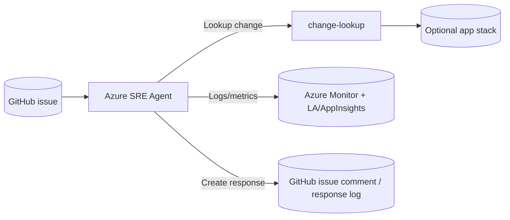

# S3 — Change Issue Triage & Auto‑Rollback

Persona: Platform SRE / On‑call
Time to complete: ~15–20 minutes (after S1/S2)
Prerequisite: SRE Agent deployed (Terraform) and the optional app stack enabled for change correlation.

---

## Story
A GitHub issue comes in after a deployment or change request. The Azure SRE Agent classifies the issue, looks up the related change record, correlates it with application telemetry, and drafts a clear response with the likely root cause and next action.

## To enable the legacy change-triage path
- Set `deploy_apps = true` in your tfvars file so Terraform creates the optional app stack.
- Keep the `change-lookup` app deployed; the `issue-triager` agent reads change context from it.
- Run the `change-lookup` service locally or deploy it with the lab so the agent can call `/changes/{cr}`.
- Make sure the `issue-triager` scheduled task/agent config is present in `sre-config/agents/issue-triager.yaml`.
- Use this path when you want GitHub issue classification plus CR correlation; use the S3 incident-response scenario when you want the Kubernetes flow.

---

## Architecture (high level)


---

## Trigger
- New GitHub issue or triage request from the issue queue.
- Optional app alert → Action Group → Agent HTTP trigger.

---

## Response plan (YAML sketch)
```yaml
name: change-issue-triage-and-response
triggers:
  - type: githubIssue
    filter: S3-change-triage
steps:
  - name: gather-evidence
    run:
      - issueDetails: true
      - changeLookup: true
      - kql: |
          AppRequests
          | where timestamp > ago(15m)
          | summarize errors=sum(toint(success==false)), p95=percentile(duration,95)
      - kql: |
          traces
          | where timestamp > ago(15m)
          | summarize by severityLevel, message
  - name: classify-issue
    eval:
      compare:
        issueType: "deployment regression"
        confidence: ">= medium"
    on_true: draft-response
  - name: draft-response
    run:
      - summarizeRootCause: true
      - suggestNextAction: true
      - when: appRegression
        recommend: "rollback latest deployment or revert the change request"
      - when: noAppRegression
        recommend: "route to product/engineering for functional triage"
  - name: incident
    createIncident:
      include:
        - timeline
        - issueSummary
        - correlatedChange
        - logs
        - recommendedResponse
```

---

## Skills invoked (examples)
- GitHub issue triage and response drafting.
- Change correlation via `change-lookup`.
- Observability: KQL against Log Analytics + App Insights.
- Optional app-stack diagnostics for the legacy path.

Example commands the agent executes with Managed Identity:
```bash
curl https://change-lookup/changes/<cr>
```

---

## Terraform references
Use the optional app module under `infra/apps.tf` when `deploy_apps = true`:
- `orders-api` sample app
- `change-lookup` service
- outputs for app endpoints in `infra/output.tf`

Inputs to set per environment:
```hcl
variable "deploy_apps" { default = false }
variable "resource_group_name" {}
variable "location" { default = "uksouth" }
variable "action_mode" { default = "Review" } # use "Automatic" after confidence
```

---

## Run
1) Open a GitHub issue or submit a change triage request.
2) The agent looks up the related change and application telemetry.
3) The agent posts a concise response with root cause, confidence, and next action.

---

## Validation
- The issue is classified correctly.
- The response cites the correlated change and telemetry.
- The incident record includes timeline, logs, and recommended action.

---

## Knowledge base
- [http-500-errors.md](../../knowledge-base/http-500-errors.md)
- On‑call handoff template: [on-call-handoff.md](../../knowledge-base/on-call-handoff.md)
- Incident report template: [incident-report.md](../../knowledge-base/incident-report.md)
