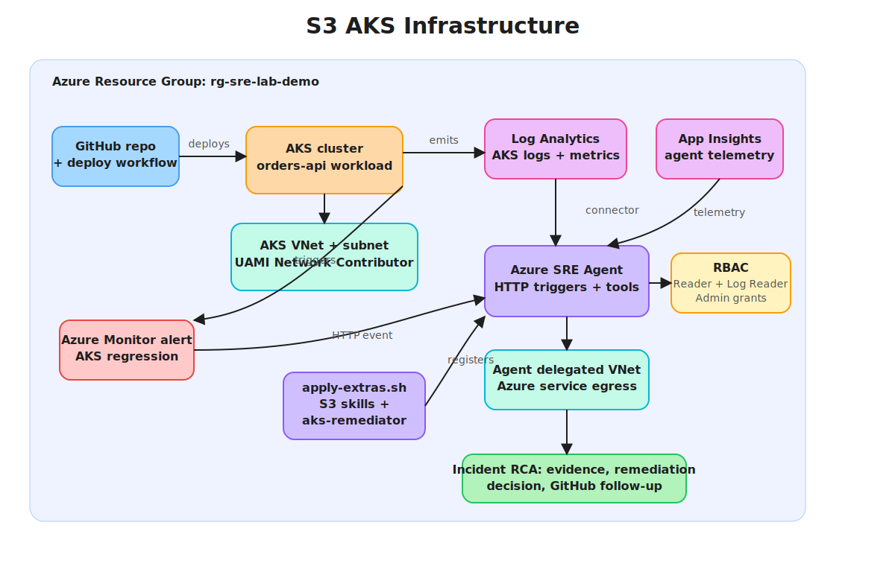

# S3 — Incident Root Cause Investigation

Persona: Platform SRE / On-call

## Story

A new deployment hits AKS and the `orders-api` workload becomes unhealthy. Pods fail readiness, crash loop, or nodes show pressure. Azure Monitor detects the AKS symptoms from Log Analytics, ServiceNow owns the S3 incident lifecycle, and the Azure SRE Agent triages evidence, restarts pods, drains bad nodes if needed, scales where appropriate, and rolls back to a known-good revision or GitOps commit. The ServiceNow incident is updated with timeline and evidence.

## Architecture (high level)


- AKS workload: `orders-api` or a similar demo service
- Observability: Azure Monitor, Log Analytics, Application Insights
- Workload manifest: `infra/k8s/orders-api.yaml`
- Trigger path: GitHub repo change → deployment → AKS telemetry → Azure Monitor alert → incident platform
- ServiceNow path: ServiceNow incident platform → `snow-aks-incidents` response plan → `aks-remediator`
- HTTP trigger path: optional test bridge for direct Azure Monitor webhook ingestion
- Decision loop: gather evidence → detect regression → remediate safely → record incident
- Optional GitOps path: Flux or Argo rollback instead of direct `kubectl` undo

## Trigger

New deployment → within 2–5 minutes: 5xx↑, latency↑, CrashLoopBackOff, node CPU↑.
Azure Monitor alert → ServiceNow incident platform → Azure SRE Agent response plan. The HTTP trigger bridge is only for direct testing.

## Incident Flow and Event Sources

S3 uses AKS telemetry as the production signal and ServiceNow as the incident platform. Azure Monitor alerts on pod and node health, ServiceNow owns the incident lifecycle, and GitHub is only supporting context if the investigation needs to correlate the outage with a recent deployment. ServiceNow is still opt-in at the environment level so other scenarios do not have to use it.

| Event source | Purpose | Configuration |
|---|---|---|
| AKS pod crash loop alert | Fires when pods enter CrashLoopBackOff, image pull failure, or container error states | Created by Terraform with S3 alert resources in `infra/terraform/alerts.tf` |
| AKS pods not ready alert | Fires when pods are not running, not succeeded, or containers are not ready | Created by Terraform with S3 alert resources in `infra/terraform/alerts.tf` |
| AKS node pressure alert | Fires when node CPU pressure crosses the S3 alert threshold | Created by Terraform with S3 alert resources in `infra/terraform/alerts.tf` |
| ServiceNow incident platform | Owns the S3 incident lifecycle and routes AKS incidents to `aks-remediator` | Configure ServiceNow values in the environment tfvars and provide `SERVICENOW_PASSWORD` as a GitHub secret |
| Agent HTTP trigger | Optional direct test path for common alert payloads | Enabled by `EnableHttpTriggers = true`; use only when an event bridge is intentionally configured |
| GitHub deployment context | Optional evidence for identifying whether a recent change caused the AKS outage | Link commit SHA, PR, or workflow run in the incident notes only when relevant |
| GitHub issue follow-up | Keeps remediation work visible in the repo after the incident | Create or link an issue with the incident ID, alert evidence, and remediation actions |

For ServiceNow-enabled environments, set non-secret values in the environment tfvars and provide the password through `TF_VAR_service_now_password` or the `SERVICENOW_PASSWORD` GitHub secret:

```hcl
enable_service_now_connector = true
service_now_instance         = "https://<instance>.service-now.com"
service_now_username         = "<username>"
```

For environments that intentionally use an explicit HTTP event bridge, set:

```hcl
enable_webhook_bridge      = true
webhook_bridge_trigger_url = "<logic-app-or-bridge-trigger-url>"
```

Keep GitHub links in the incident payload or agent notes so the investigation can trace from alert → deployment → PR → follow-up issue.

## Response plan (YAML sketch)

```yaml
name: shared-incident-response
triggers:
  - type: serviceNow
    filter: aks-regression
steps:
  - gatherEvidence: [kql, aksEvents, podLogs, githubDeployment]
  - routeTo: aks-remediator
  - remediateSafely: [restart, drain, scale, rollback]
  - recordIncident: [timeline, evidence, githubLinks, actionsTaken]
```

## Skills invoked (examples)

- Kubernetes Ops: rollout restart/undo, get events, node drain
- Azure CLI Ops: AKS nodepool scale
- Observability: KQL against Log Analytics + App Insights for error/latency. For AKS, prefer `KubePodInventory`, `KubeEvents`, `InsightsMetrics`, and `ContainerLogV2`; fall back to legacy `ContainerLog` when `ContainerLogV2` is not enabled.
- GitOps (optional): Flux/Argo rollback or commit revert
- GitHub repo context: PR, commit SHA, workflow run, deployment event, and follow-up issue link

## Example commands the agent executes with Managed Identity

```bash
kubectl rollout restart deployment/orders-api -n default
kubectl drain <node> --ignore-daemonsets --delete-emptydir-data
az aks nodepool scale -g <rg> -n <pool> --cluster-name <aks> --node-count 4
kubectl rollout undo deployment/orders-api -n default
```

## Terraform references

Use the Terraform module under `infra/`:

- Log Analytics + App Insights: `main.tf`
- AKS cluster: `aks.tf`
- Alerts: `alerts.tf`
- SRE Agent resource: `sreagent.tf` (`azapi` `Microsoft.App/agents@2025-05-01-preview`)
- Connectors: `connectors.tf`
- RBAC least-privilege + admin role: `rbac.tf`
- Outputs: `output.tf` (agent endpoint, MI id)
- AKS workload: `infra/k8s/orders-api.yaml`

## Inputs to set per environment

```hcl
variable "agent_name" {}
variable "resource_group_name" {}
variable "location" { default = "uksouth" }
variable "target_resource_groups" { default = ["app-rg"] }
variable "action_mode" { default = "Review" } # use "Automatic" after confidence
```

## Run

Merge or deploy a bad GitHub repo change, or introduce an AKS workload failure such as a bad image or crash loop.
Azure Monitor alert fires → ServiceNow incident is created → `snow-aks-incidents` routes to `aks-remediator`.
Agent gathers evidence, restarts pods, drains nodes if needed, and either stabilizes or rolls back.

Use an AKS-only tfvars file for the demo path:

```bash
terraform -chdir=infra/terraform init -reconfigure -backend-config=backend/<environment>.backend.tfvars
terraform -chdir=infra/terraform apply -auto-approve -var-file=environments/<environment>.tfvars
az aks get-credentials --resource-group <rg> --name <aks-name> --admin --overwrite-existing
kubectl apply -f infra/k8s/orders-api.yaml
bash scripts/apply-extras.sh <environment>
```

The GitHub Actions deploy workflow applies the AKS workload automatically when the Terraform output includes `aks_name`.

## Validation

- Error rate drops to baseline; pods healthy; no node pressure.
- `kubectl rollout history deployment/orders-api -n default` shows undo when applied.
- Incident record links the GitHub PR or workflow run that introduced the bad revision.
- Incident record includes timeline, graphs, logs, diff, and actions taken.

## Knowledge Base

- [http-500-errors.md](../../knowledge-base/http-500-errors.md)
- [on-call-handoff.md](../../knowledge-base/on-call-handoff.md)
- [incident-report.md](../../knowledge-base/incident-report.md)
- [orders-architecture.md](../../knowledge-base/orders-architecture.md)
