# S3 — Incident Root Cause Investigation

Persona: Platform SRE / On-call

## Story

A new deployment hits AKS and 5xx/latency spike. Some pods crashloop, nodes show pressure. Azure Monitor fires; the Azure SRE Agent triages evidence, restarts pods, drains bad nodes if needed, scales where appropriate, and rolls back to a known-good revision (or reverts the last GitOps commit). Incident is auto-created with timeline and evidence.

```mermaid
flowchart LR
  pr[GitHub PR / merge] --> deploy[Deployment workflow]
  deploy --> aks[AKS orders-api]
  aks --> alert[Azure Monitor alert]
  alert --> actionGroup[Action Group]
  actionGroup --> httpTrigger[SRE Agent HTTP trigger]
  httpTrigger --> orchestrator[incident-orchestrator]
  orchestrator --> remediator[aks-remediator]
  remediator --> evidence[Collect KQL, pod logs, events, rollout history]
  evidence --> decision{Regression confirmed?}
  decision -- no --> record[Record incident summary]
  decision -- yes --> fix[Restart, drain, scale, or rollback]
  fix --> verify[Verify service health]
  verify --> issue[Link GitHub PR / workflow / follow-up issue]
  issue --> record
```



## Architecture (high level)

- AKS workload: `orders-api` or a similar demo service
- Observability: Azure Monitor, Log Analytics, Application Insights
- Trigger path: GitHub repo change → deployment → Azure Monitor alert → Action Group → agent HTTP trigger
- Event path: GitHub repo/deployment events plus Azure Monitor Action Group webhook receiver → agent HTTP trigger
- Decision loop: gather evidence → detect regression → remediate safely → record incident
- Optional GitOps path: Flux or Argo rollback instead of direct `kubectl` undo

## Trigger

New deployment → within 2–5 minutes: 5xx↑, latency↑, CrashLoopBackOff, node CPU↑.
Azure Monitor alert → Action Group → Agent HTTP trigger.

## HTTP trigger and event sources

S3 should showcase an HTTP trigger because this is the external entrypoint for production events. GitHub is the source of truth for changes, deployment evidence, and engineering follow-up, while Azure Monitor provides the production alert event.

| Event source | Purpose | Configuration |
|---|---|---|
| GitHub PR / merge event | Shows which repo change or deployment likely introduced the regression | Link the deployment, commit SHA, PR, and workflow run in the incident context |
| GitHub deployment event | Carries the environment and revision that reached AKS | Use the repo's deployment workflow or deployment event as change evidence |
| Azure Monitor action group | Fires when the AKS regression alert triggers | Created by Terraform with the S3 alert resources |
| Webhook receiver | Sends the common alert payload to the SRE Agent ingestion path | Set `webhook_bridge_trigger_url` to an existing bridge URL |
| Agent HTTP trigger | Lets the SRE Agent receive the event payload and route to `incident-orchestrator` | Enabled by `EnableHttpTriggers = true` on the agent resource |
| GitHub issue follow-up | Keeps remediation work visible in the repo after the incident | Create or link an issue with the incident ID, PR, deployment, and rollback evidence |

For environments that need an explicit event bridge, set:

```hcl
enable_webhook_bridge      = true
webhook_bridge_trigger_url = "<logic-app-or-bridge-trigger-url>"
```

If `webhook_bridge_trigger_url` is set, Terraform adds it to the S3 Azure Monitor action group as a webhook receiver using the common alert schema. Keep GitHub links in the incident payload or agent notes so the investigation can trace from alert → deployment → PR → follow-up issue.

## Response plan (YAML sketch)

```yaml
name: shared-incident-response
triggers:
  - type: azureMonitor
    filter: aks-regression
  - type: github
    filter: deployment-or-merge
steps:
  - gatherEvidence: [kql, aksEvents, podLogs, githubDeployment]
  - routeTo: aks-remediator
  - remediateSafely: [restart, drain, scale, rollback]
  - recordIncident: [timeline, evidence, githubLinks, actionsTaken]
```

## Skills invoked (examples)

- Kubernetes Ops: rollout restart/undo, get events, node drain
- Azure CLI Ops: AKS nodepool scale
- Observability: KQL against Log Analytics + App Insights for error/latency. For AKS, prefer `KubePodInventory`, `KubeEvents`, `InsightsMetrics`, and `ContainerLogV2`; fall back to legacy `ContainerLog` when `ContainerLogV2` is not enabled.
- GitOps (optional): Flux/Argo rollback or commit revert
- GitHub repo context: PR, commit SHA, workflow run, deployment event, and follow-up issue link

## Example commands the agent executes with Managed Identity

```bash
kubectl rollout restart deployment/orders-api -n default
kubectl drain <node> --ignore-daemonsets --delete-emptydir-data
az aks nodepool scale -g <rg> -n <pool> --cluster-name <aks> --node-count 4
kubectl rollout undo deployment/orders-api -n default
```

## Terraform references

Use the Terraform module under `infra/`:

- Log Analytics + App Insights: `main.tf`
- AKS cluster: `aks.tf`
- Alerts: `alerts.tf`
- SRE Agent resource: `sreagent.tf` (`azapi` `Microsoft.App/agents@2025-05-01-preview`)
- Connectors: `connectors.tf`
- RBAC least-privilege + admin role: `rbac.tf`
- Outputs: `output.tf` (agent endpoint, MI id)

## Inputs to set per environment

```hcl
variable "agent_name" {}
variable "resource_group_name" {}
variable "location" { default = "uksouth" }
variable "target_resource_groups" { default = ["app-rg"] }
variable "action_mode" { default = "Review" } # use "Automatic" after confidence
```

## Run

Merge or deploy a bad GitHub repo change (e.g., raise error rate).
Azure Monitor alert fires → Action Group event reaches the HTTP trigger → agent plan runs.
Agent gathers evidence, restarts pods, drains nodes if needed, and either stabilizes or rolls back.

Use an AKS-only tfvars file for the demo path:

```bash
terraform -chdir=infra/terraform init -reconfigure -backend-config=backend/<environment>.backend.tfvars
terraform -chdir=infra/terraform apply -auto-approve -var-file=environments/<environment>.tfvars
bash scripts/apply-extras.sh <environment>
```

## Validation

- Error rate drops to baseline; pods healthy; no node pressure.
- `kubectl rollout history deployment/orders-api -n default` shows undo when applied.
- Incident record links the GitHub PR or workflow run that introduced the bad revision.
- Incident record includes timeline, graphs, logs, diff, and actions taken.

## Knowledge Base

- [http-500-errors.md](../../knowledge-base/http-500-errors.md)
- [on-call-handoff.md](../../knowledge-base/on-call-handoff.md)
- [incident-report-template.md](../../knowledge-base/incident-report-template.md)
- [orders-architecture.md](../../knowledge-base/orders-architecture.md)
