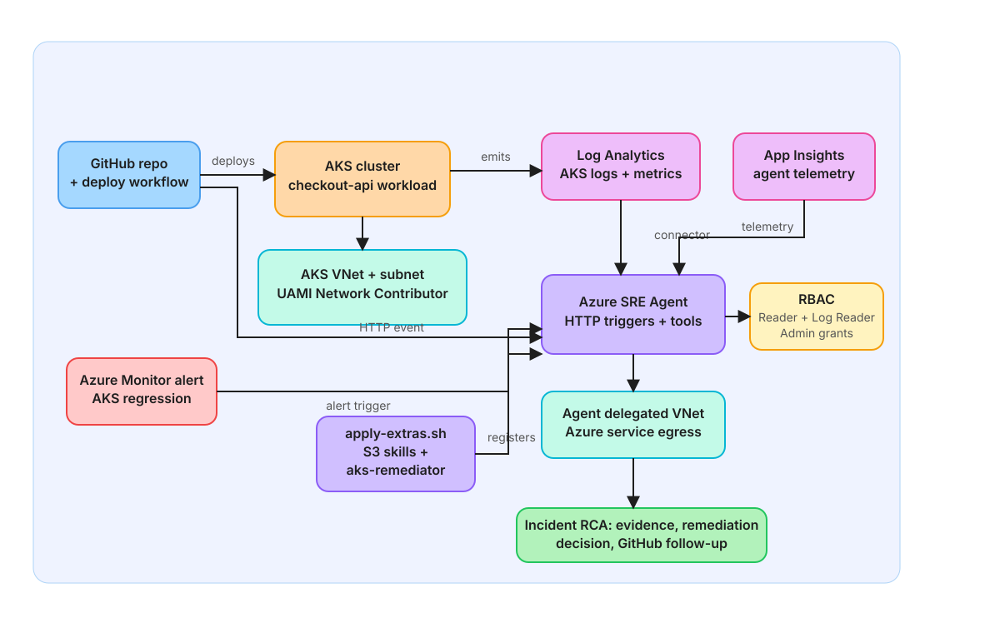

# S3 — Incident Root Cause Investigation

Persona: Platform SRE / On-call

## ⚡ Quick Start (5-minute demo)

```bash
# 1. Deploy the infrastructure + SRE Agent with S3 config
terraform -chdir=infra/terraform apply -auto-approve \
  -var-file=recipes/servicenow-aks-incident/terraform/terraform.tfvars.example

# 2. Apply the SRE Agent recipe (ServiceNow + KQL automations)
bash scripts/apply-extras.sh s3

# 3. Trigger the demo: deploy broken orders-api workload
kubectl apply -f infra/k8s/orders-api-broken.yaml

# 4. Watch it:
#    - Pod enters CrashLoopBackOff
#    - Azure Monitor alert fires (2-5 min)
#    - ServiceNow incident auto-created
#    - SRE Agent investigates via KQL
#    - Pod restarts or node drains
#    - ServiceNow incident closes
```

**Demo complete.** For a real GitHub Actions workflow demo, see [Run](#run) below.

## Story

A new deployment hits AKS and the `orders-api` workload becomes unhealthy. Pods fail readiness, crash loop, or nodes show pressure. Azure Monitor detects the AKS symptoms from Log Analytics, ServiceNow owns the S3 incident lifecycle, and the Azure SRE Agent triages evidence, restarts pods, drains bad nodes if needed, scales where appropriate, and rolls back to a known-good revision or GitOps commit. The ServiceNow incident is updated with timeline and evidence.

## Architecture (high level)


- **Recipe**: `servicenow-aks-incident` (orchestrates incident detection, investigation, remediation)
- **AKS workload**: `orders-api` microservice (demo app)
- **Observability**: Azure Monitor, Log Analytics, Application Insights (metrics + logs)
- **Workload manifest**: `infra/k8s/orders-api.yaml` (healthy) or `infra/k8s/orders-api-broken.yaml` (demo failure)
- **Trigger path**: Pod failure → AKS telemetry → Azure Monitor alert → ServiceNow incident platform
- **Response path**: ServiceNow incident → Azure SRE Agent → `aks-triage-agent` (KQL investigation) → `aks-remediator` (restart/drain/scale)
- **Evidence path**: KQL queries → pod logs, node metrics, deployment history → ServiceNow work notes
- **Remediation path**: Restart pod → drain unhealthy node → scale nodepool → rollback if needed
- **GitOps path** (optional): Flux/Argo rollback instead of direct `kubectl` undo

## Trigger

New deployment → within 2–5 minutes: 5xx↑, latency↑, CrashLoopBackOff, node CPU↑.
Azure Monitor alert → ServiceNow incident platform → Azure SRE Agent response plan. The HTTP trigger bridge is only for direct testing.

## Incident Flow and Event Sources

S3 uses AKS telemetry as the production signal and ServiceNow as the incident platform. Azure Monitor alerts on pod and node health, ServiceNow owns the incident lifecycle, and GitHub is only supporting context if the investigation needs to correlate the outage with a recent deployment. ServiceNow is still opt-in at the environment level so other scenarios do not have to use it.

ServiceNow incident-platform configuration means the Azure SRE Agent can process ServiceNow incidents and apply the `snow-aks-incidents` response plan. It does not, by itself, make Azure Monitor create ServiceNow incidents. An alert-to-ServiceNow bridge is still required for production alert ingestion. In this lab, the deploy workflow creates a ServiceNow incident when the AKS `orders-api` rollout fails; Azure Monitor alert ingestion can be added through a ServiceNow Azure Monitor integration, ITSM connector, or webhook bridge.

| Event source | Purpose | Configuration |
|---|---|---|
| AKS pod crash loop alert | Fires when pods enter CrashLoopBackOff, image pull failure, or container error states | Created by Terraform with S3 alert resources in `infra/terraform/alerts.tf` |
| AKS pods not ready alert | Fires when pods are not running, not succeeded, or containers are not ready | Created by Terraform with S3 alert resources in `infra/terraform/alerts.tf` |
| AKS node pressure alert | Fires when node CPU pressure crosses the S3 alert threshold | Created by Terraform with S3 alert resources in `infra/terraform/alerts.tf` |
| ServiceNow incident platform | Owns the S3 incident lifecycle and routes AKS incidents to `aks-remediator` | Configure ServiceNow values in the environment tfvars and provide `SERVICENOW_PASSWORD` as a GitHub secret |
| Agent HTTP trigger | Optional direct test path for common alert payloads | Enabled by `EnableHttpTriggers = true`; use only when an event bridge is intentionally configured |
| GitHub deployment context | Optional evidence for identifying whether a recent change caused the AKS outage | Link commit SHA, PR, or workflow run in the incident notes only when relevant |
| GitHub issue follow-up | Keeps remediation work visible in the repo after the incident | Create or link an issue with the incident ID, alert evidence, and remediation actions |

For ServiceNow-enabled environments, set non-secret values in the environment tfvars and provide the password through `TF_VAR_service_now_password` or the `SERVICENOW_PASSWORD` GitHub secret:

```hcl
enable_service_now_connector = true
service_now_instance         = "https://<instance>.service-now.com"
service_now_username         = "<username>"
```

For environments that intentionally use an explicit HTTP event bridge, set:

```hcl
webhook_bridge_trigger_url = "<logic-app-or-bridge-trigger-url>"
```

Keep GitHub links in the incident payload or agent notes so the investigation can trace from alert → deployment → PR → follow-up issue.

## Response plan (YAML sketch)

```yaml
name: shared-incident-response
triggers:
  - type: serviceNow
    filter: aks-regression
steps:
  - gatherEvidence: [kql, aksEvents, podLogs, githubDeployment]
  - routeTo: aks-remediator
  - remediateSafely: [restart, drain, scale, rollback]
  - recordIncident: [timeline, evidence, githubLinks, actionsTaken]
```

## Skills invoked (examples)

- Kubernetes Ops: rollout restart/undo, get events, node drain
- Azure CLI Ops: AKS nodepool scale
- Observability: KQL against Log Analytics + App Insights for error/latency. For AKS, prefer `KubePodInventory`, `KubeEvents`, `InsightsMetrics`, and `ContainerLogV2`; fall back to legacy `ContainerLog` when `ContainerLogV2` is not enabled.
- GitOps (optional): Flux/Argo rollback or commit revert
- GitHub repo context: PR, commit SHA, workflow run, deployment event, and follow-up issue link

## Example commands the agent executes with Managed Identity

```bash
kubectl rollout restart deployment/orders-api -n default
kubectl drain <node> --ignore-daemonsets --delete-emptydir-data
az aks nodepool scale -g <rg> -n <pool> --cluster-name <aks> --node-count 4
kubectl rollout undo deployment/orders-api -n default
```

## Recipe & Terraform

**S3 uses the `servicenow-aks-incident` recipe** for Azure SRE Agent configuration:

- **Recipe location**: `recipes/servicenow-aks-incident/`
- **Recipe provides**: Agent prompts, ServiceNow connector config, incident automations (filters, platforms), subagent definitions (aks-triage-agent, aks-remediator)
- **Shared Terraform** under `infra/terraform/`:
  - Log Analytics + App Insights: `main.tf`
  - AKS cluster: `aks.tf`
  - Alerts: `alerts.tf` (pod crash, node pressure)
  - SRE Agent resource: `sreagent.tf` (`azapi` `Microsoft.App/agents@2025-05-01-preview`)
  - ServiceNow connector: `connectors.tf`
  - RBAC least-privilege: `rbac.tf`
  - Outputs: `output.tf` (agent endpoint, MI id, AKS details)
- **S3 workload**: `infra/k8s/orders-api.yaml` (healthy baseline)

## Configuration (from recipe)

The `servicenow-aks-incident` recipe provides `terraform.tfvars.example` with S3-specific values:

```hcl
# S3 configuration (copy to terraform.tfvars)
agent_name                      = "s3-aks-incident-agent"
resource_group_name             = "s3-rg"
location                        = "uksouth"
scenario                        = "s3"
enable_service_now_connector    = true
service_now_instance_url        = "https://<instance>.service-now.com"
service_now_username            = "<username>"
# service_now_password provided via TF_VAR_service_now_password env var or GitHub secret
aks_cluster_name                = "s3-aks-cluster"
action_mode                     = "Review" # use "Automatic" after testing
```

See `recipes/servicenow-aks-incident/terraform/terraform.tfvars.example` for all options.

## 🎬 Lab Walkthrough: Step-by-Step

### Phase 1: Setup (5 mins)

```bash
# 1️⃣  Initialize and deploy all S3 infrastructure
cd infra/terraform
terraform init -reconfigure -backend-config=backend/demo.backend.tfvars
terraform apply -auto-approve \
  -var-file=../../recipes/servicenow-aks-incident/terraform/terraform.tfvars.example \
  -var="resource_group_name=s3-demo-rg" \
  -var="agent_name=s3-agent"

# 2️⃣  Configure kubectl access
az aks get-credentials --resource-group s3-demo-rg --name s3-aks-cluster --admin --overwrite-existing

# 3️⃣  Register SRE Agent automations (ServiceNow connector, incident filters, subagents)
bash ../../scripts/apply-extras.sh s3

# ✅ All infrastructure ready. Verify:
kubectl get nodes
kubectl get ns
```

### Phase 2: Deploy Healthy Baseline (2 mins)

```bash
# 4️⃣  Deploy working orders-api (verify it scales and serves traffic)
kubectl apply -f ../../infra/k8s/orders-api.yaml
kubectl get pods -n default -w
# Wait: Deployment "orders-api" is running with 3 replicas ✅
```

### Phase 3: Trigger Incident (LIVE DEMO) (1 min)

```bash
# 5️⃣  TRIGGER: Deploy broken workload (bad image, OOM crash loop)
kubectl apply -f ../../infra/k8s/orders-api-broken.yaml
kubectl get pods -n default -w
# Watch: CrashLoopBackOff appears 🔴
# Next: Azure Monitor alert fires (2–5 mins)
# Then: ServiceNow incident auto-created
```

### Phase 4: Observe Incident Response (3–5 mins)

While incident auto-flows through the system:

```bash
# 📊 Watch pod logs
kubectl logs deployment/orders-api -n default -f

# 🔍 Monitor node health
kubectl get nodes -o wide
kubectl top nodes

# 🧪 See what the SRE Agent investigates (KQL queries):
# - KubePodInventory (pod state, restarts, readiness)
# - ContainerLogV2 (crash logs, error messages)
# - InsightsMetrics (CPU, memory, disk pressure)
# - KubeEvents (pod state transitions)

# 🎟️  Track ServiceNow incident:
# - Log into ServiceNow → Incidents
# - Search: "AKS orders-api"
# - Watch aks-triage-agent add investigation notes
# - Watch aks-remediator propose remediation
```

### Phase 5: Remediation & Resolution (2–3 mins)

SRE Agent auto-executes (or proposes if `action_mode = Review`):

```bash
# The agent will execute one of:
# Option A: Restart pod
kubectl rollout restart deployment/orders-api -n default

# Option B: Drain unhealthy node (if node pressure)
kubectl drain <node-name> --ignore-daemonsets --delete-emptydir-data

# Option C: Scale nodepool (if resource constrained)
az aks nodepool scale -g s3-demo-rg -n nodepool1 --cluster-name s3-aks-cluster --node-count 4

# Option D: Rollback to good revision
kubectl rollout undo deployment/orders-api -n default

# 🔄 Watch recovery
kubectl get pods -n default -w
# Expected: Pods return to Running/Ready ✅
```

### Phase 6: Verify Closure (1 min)

```bash
# ✅ Confirm incident resolved:
kubectl get deployment orders-api -n default
# Desired: 3, Current: 3, Ready: 3, Available: 3

# ✅ ServiceNow incident closed with:
# - Timeline of events
# - Root cause analysis (KQL findings)
# - Remediation actions taken
# - Evidence (logs, metrics links)
# - Links to deployment/PR that caused outage
```

## 🎯 Presentation Demo Flow

| Step | Action | Duration | Audience Impact |
|------|--------|----------|-----------------|
| 1 | Run Phases 1–2 setup | 5 min | Show: Full automation, no manual config |
| 2 | **Pause here for intro** | — | Audience understands baseline state |
| 3 | Run Phase 3: trigger incident | 30 sec | 🔴 Live failure (dramatic moment) |
| 4 | Show ServiceNow incident created | 30 sec | ✨ Auto-detection magic |
| 5 | Show SRE Agent investigation | 1 min | 🔍 KQL queries, root cause found |
| 6 | Show remediation proposed | 1 min | ✅ Agent proposes safe actions |
| 7 | Approve + watch fix | 2–3 min | 🚀 Pod restarts, incident closes |
| 8 | Show full incident record | 1 min | 📋 Timeline + evidence captured |
| **Total** | | **11–12 min** | Complete incident lifecycle |

## Validation

- Error rate drops to baseline; pods healthy; no node pressure.
- `kubectl rollout history deployment/orders-api -n default` shows undo when applied.
- Incident record links the GitHub PR or workflow run that introduced the bad revision.
- Incident record includes timeline, graphs, logs, diff, and actions taken.

## Knowledge Base

- [http-500-errors.md](../../knowledge-base/http-500-errors.md)
- [on-call-handoff.md](../../knowledge-base/on-call-handoff.md)
- [incident-report.md](../../knowledge-base/incident-report.md)
- [orders-architecture.md](../../knowledge-base/orders-architecture.md)
