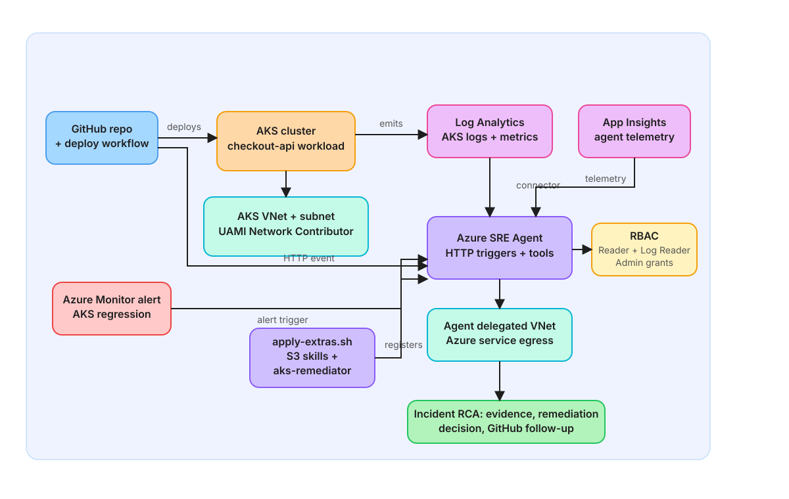

# Lab S3: Investigate an AKS incident with Azure SRE Agent and ServiceNow

**Persona:** Platform SRE / Incident Commander  
**Estimated time:** 30 minutes, plus deployment  
**Recipe:** `alert-response-incident-operations`

## Scenario

A rollout to Azure Kubernetes Service (AKS) breaks checkout. The `checkout-api`
pods look perfectly healthy, `Running` and `Ready`, with normal CPU and memory,
yet customers' checkout requests time out. The cause is a Kubernetes `Service`
whose selector no longer matches the pods, so it has zero endpoints.

In this lab you reproduce that outage, raise a Priority 1 ServiceNow incident,
and watch Azure SRE Agent find the root cause and write it back to the
incident. The agent investigates only; you stay in charge of the fix.

```text
ServiceNow incident → ServiceNow connector → Azure SRE Agent
  → aks-triage-agent → incident-summary-agent → incident-comms-agent
  → work note + RCA attached to the incident
```



## Learning objectives

By the end of this lab, you can:

- Reproduce an AKS routing failure where pods are healthy but traffic fails.
- Start an Azure SRE Agent investigation from a ServiceNow incident.
- Follow and question the investigation from GitHub Copilot CLI through the
  Azure MCP server.
- Confirm the root cause, the ServiceNow write-back, and restore the service.

## Prerequisites

- Azure CLI signed in (`az login`) and `kubectl` installed.
- GitHub CLI signed in, with the [deployment workflow](../../.github/workflows/deploy.yml)
  and its Azure credentials configured.
- GitHub Copilot CLI with the Azure MCP server (`@azure/mcp@latest`) in
  `~/.copilot/mcp-config.json`.
- A ServiceNow instance and integration user. `service_now_instance` and
  `service_now_username` are set in `infra/terraform/environments/demo.tfvars`,
  and the password is stored as the `SERVICENOW_PASSWORD` repository secret.

> [!NOTE]
> The lab targets `rg-sre-lab-demo` and the agent `sre-agent-platform`, which
> runs in **Review** mode: it needs approval for any write action.

---

## Exercise 1: Prepare the environment

### Task 1: Deploy the lab

1. Run the deployment workflow for the `demo` environment:

   ```bash
   gh workflow run deploy.yml -f environment=demo -f runtime=aks -f plan=true -f apply=true
   gh run watch
   ```

   The workflow creates AKS, the Azure SRE Agent and its three subagents, the
   ServiceNow response plans, and deploys the healthy `checkout-api`.

### Task 2: Enable the ServiceNow write-back

The workflow doesn't pass ServiceNow credentials to the agent's write-back
tools, so it skips them. Register them from your machine:

1. Export the credentials, using the instance and user from `demo.tfvars`:

   ```bash
   export SERVICENOW_URL='https://<instance>.service-now.com'
   export SERVICENOW_USER='<integration user>'
   export SERVICENOW_PASS='<integration user password>'
   ```

2. Apply the agent configuration:

   ```bash
   bash scripts/apply-extras.sh demo
   ```

   The output lists `UpdateServiceNowIncident`, `UploadServiceNowAttachment`
   and the `servicenow-incident-update` skill. If you skip this task, the agent
   still investigates but only drafts the incident update for you to post.

### Task 3: Confirm the agent is ready

1. Start `copilot` in the repository and enter:

   ```text
   Use the Azure MCP server to show the SRE Agent sre-agent-platform in
   rg-sre-lab-demo: its provisioning state, its subagents, and its incident
   response plans.
   ```

2. Approve each tool call yourself. Do not choose an option that allows all
   tools.

3. Confirm the output shows:
   - the subagents `aks-triage-agent`, `incident-summary-agent` and
     `incident-comms-agent`
   - the `aks-incidents` ServiceNow response plan

---

## Exercise 2: Break checkout-api routing

### Task 1: Connect to the cluster

1. Get credentials for the lab cluster:

   ```bash
   AKS_NAME="$(az aks list --resource-group rg-sre-lab-demo --query "[0].name" --output tsv)"
   az aks get-credentials --resource-group rg-sre-lab-demo --name "$AKS_NAME" --admin
   ```

### Task 2: Introduce selector drift

1. Apply the broken Service. It changes only the selector, to
   `app: checkout-api-shadow`:

   ```bash
   kubectl apply -f infra/k8s/checkout-api-service-no-endpoints.yaml
   ```

2. Confirm the pods are still healthy but the Service has no endpoints:

   ```bash
   kubectl get pods --namespace default -l app=checkout-api
   kubectl get endpoints checkout-api --namespace default
   ```

   The pods show `Running` and `1/1` ready. The endpoints list is empty.

> [!NOTE]
> Within 5–10 minutes the Azure Monitor alert **AKS checkout-api service has no
> endpoints** fires and emails the on-call. That alert does not reach the
> agent. The ServiceNow incident in the next exercise is what starts the
> investigation.

---

## Exercise 3: Raise the ServiceNow incident

1. Open the Priority 1 incident. The script uses `SERVICENOW_PASS` from
   Exercise 1:

   ```bash
   bash scripts/servicenow-incident.sh demo
   ```

   The script creates an incident with:

   | Field | Value |
   |---|---|
   | Short description | `AKS checkout-api service has no endpoints` |
   | Impact / urgency | `1` / `1` (Priority 1) |
   | Category | `network` |
   | Description | Checkout timing out, pods `Running` and `Ready`, node CPU and memory normal, recent rollout |

2. Within a few minutes the ServiceNow connector picks up the incident. Its
   title and priority match the `aks-incidents` response plan, which hands it
   to `aks-triage-agent`.

> [!TIP]
> To show that the response plan ignores unrelated incidents, pass a
> different title as the second argument, for example
> `bash scripts/servicenow-incident.sh demo "Printer offline"`.

---

## Exercise 4: Follow the investigation

### Task 1: Watch the handoff chain

1. In Copilot CLI, enter:

   ```text
   Use the Azure MCP server to list active incidents and recent threads on
   sre-agent-platform, then show the messages in the thread for
   "AKS checkout-api service has no endpoints".
   ```

2. Follow the three subagents in order:
   - **`aks-triage-agent`** gathers evidence. Pods are healthy
     (`KubePodInventory`), the Service exists (`KubeServices`), there's no
     pressure (`InsightsMetrics`), and there are no app crashes
     (`ContainerLogV2`). It then ties the failure to the recent apply
     (`KubeEvents`).
   - **`incident-summary-agent`** writes the incident summary and the
     root-cause analysis, using the `incident-root-cause-analysis` skill.
   - **`incident-comms-agent`** posts the result to ServiceNow.

### Task 2: Ask the agent a question

1. Send a follow-up into the same thread:

   ```text
   Use the Azure MCP server to send this message to that thread: "Which pods
   does the checkout-api Service selector match, and what labels do the
   Running checkout-api pods have? Do not change anything."
   ```

2. The agent answers in the thread: the selector `app: checkout-api-shadow`
   matches no pods, and the pods are labelled `app: checkout-api`.

> [!IMPORTANT]
> Never approve the `investigate_yolo` tool. It approves every pending agent
> action automatically, which bypasses Review mode and lets the agent change
> the cluster.

### Task 3: Check the ServiceNow incident

1. Open the incident in ServiceNow and confirm that the work note says:
   - **Customer impact:** checkout requests failing or timing out.
   - **What stayed healthy:** AKS nodes and the `checkout-api` pods.
   - **Root cause:** the `checkout-api` Service selector no longer matches the
     pods, leaving zero endpoints.
   - **Affected resources:** the `checkout-api` Deployment and Service in the
     `default` namespace.
   - **Implicated change:** the most recent rollout.
   - **Next step:** restore the selector or reapply the healthy manifest, after
     operator approval.

2. Open the attached RCA and confirm it has a timeline and a numbered
   **5 Whys** that ends at the missing guardrail: nothing checks that a
   Service selector matches its pods.

3. Confirm the incident state is unchanged. The agent can add notes but can't
   resolve or reassign an incident.

---

## Exercise 5: Restore the service

1. Reapply the healthy manifest, which restores the `app: checkout-api`
   selector:

   ```bash
   kubectl apply -f infra/k8s/checkout-api.yaml
   kubectl get endpoints checkout-api --namespace default
   ```

   The endpoints list now shows the pod IP addresses.

2. Resolve the ServiceNow incident yourself.

---

## Check your work

- [ ] The pods stayed `Running` and `Ready` while the Service had no endpoints.
- [ ] Opening the ServiceNow incident started the investigation; breaking the
  cluster alone did not.
- [ ] The thread shows triage → summary → communications, in that order.
- [ ] The agent named the selector mismatch as the root cause, not a pod or
  node problem.
- [ ] The RCA has a sourced timeline and a 5 Whys, with the trigger (the
  rollout) separate from the underlying cause (no selector check).
- [ ] The incident has the agent's work note and RCA attachment, and the agent
  made no changes to the cluster or the incident state.
- [ ] Endpoints returned after you reapplied the healthy manifest.

## Summary

In this lab you reproduced an outage where every pod looked healthy and
traffic still failed. A ServiceNow incident handed it to Azure SRE Agent, which
used three subagents to find the selector drift, documented it on the incident,
and left the fix to you. You followed and questioned the investigation from
Copilot CLI through the Azure MCP server.

---

## Reference

### How the incident reaches the agent

With `enable_service_now_connector = true`, the agent's incident platform is
ServiceNow, so only ServiceNow incidents start an investigation. The Azure
Monitor alerts in `infra/terraform/alerts.tf` notify people by email and do not
call the agent. There is no HTTP trigger in this lab.

### Response plans

| Plan | Matches |
|---|---|
| `aks-incidents` | Priority 1–3, title contains `checkout-api` |
| `aks-crashloop-incidents` | Priority 1–2, title contains `AKS - CrashLoop/OOM detected` |
| `aks-node-pressure-incidents` | Priority 1–2, title contains `AKS node CPU pressure` |
| `aks-hpa-incidents` | Priority 1–2, title contains `AKS HPA` |

The checked-in plans filter on priority and title only. To also filter on
assignment group, configuration item or category, use the portal's advanced
filters: see
[incident-filters/README.md](../../recipes/azmon-lawappinsights/incident-platforms/servicenow/incident-filters/README.md#advanced-filters-are-a-portal-feature).

### ServiceNow write-back

The `servicenow-incident-update` skill owns all ServiceNow writes through two
narrow tools:

- `UpdateServiceNowIncident` writes work notes (and comments only when asked).
  It never touches state, assignment or close fields.
- `UploadServiceNowAttachment` attaches the RCA.

`scripts/apply-extras.sh` writes `SERVICENOW_URL`, `SERVICENOW_USER` and
`SERVICENOW_PASS` into the tools when it registers them. If they aren't set,
as in the GitHub workflow, the tools and the skill are skipped, and the agent
drafts the update for a person to post instead.

### Three-agent handoff chain

The recipe adapts the roles from
[`leestott/On-Call-Copilot-Multi-Agent`](https://github.com/leestott/On-Call-Copilot-Multi-Agent),
which runs four roles concurrently. S3 merges its summary and communication
roles into a sequential, three-agent Azure SRE Agent chain:
`aks-triage-agent → incident-summary-agent → incident-comms-agent`.

### Files

| What | Where |
|---|---|
| Environment settings | `infra/terraform/environments/demo.tfvars` |
| Healthy workload | `infra/k8s/checkout-api.yaml` |
| Selector-drift manifest | `infra/k8s/checkout-api-service-no-endpoints.yaml` |
| Alert rules | `infra/terraform/alerts.tf` |
| Agent recipe and ServiceNow tools | `recipes/alert-response-incident-operations/` |
| Response plans | `recipes/azmon-lawappinsights/incident-platforms/servicenow/incident-filters/` |
| Skills | `.github/skills/incident-root-cause-analysis/`, `.github/skills/servicenow-incident-update/`, `.github/skills/evidence-before-after/` |
| AKS runbooks | `knowledge-base/aks-*.md` |

## Next steps

- [S4 — Alert Response & Incident Operations](../s4-alert-response-incident-operations/README.md)
- [S5 — PIM Elevation Audit](../s5-pim-elevation-audit/README.md)
- [S6 — Front Door Incident Response](../s6-frontdoor-incident-response/README.md)
