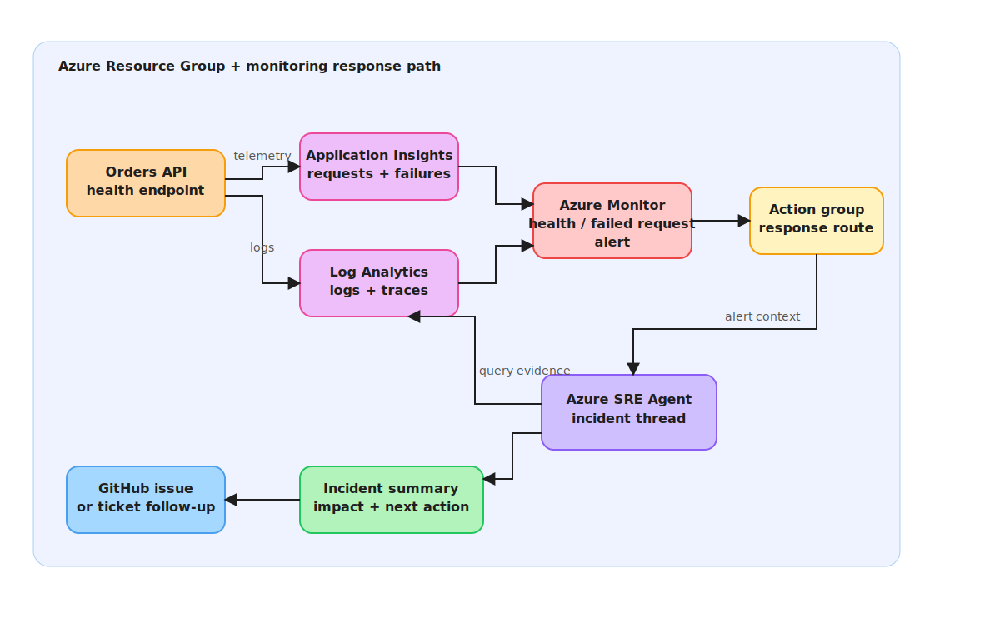

# S4 - Alert Response and Incident Operations

Persona: Platform Operations / On-call SRE

## Story

The platform team wants an operator-ready incident monitoring workflow, not another remediation demo. This scenario validates that monitoring is configured, alerts route to the right response channel, the SRE Agent can query telemetry, and operators have a clear runbook for confirming impact, creating the incident record, and escalating with evidence.

The outcome is a repeatable incident monitoring pattern: health checks detect service impact, alert rules notify the response path, the agent gathers evidence from Application Insights and Log Analytics, and the operator records a concise incident summary with owner, severity, timeline, and next action.




## Azure SRE Agent Concepts

| Concept | What you see in this scenario |
|---------|-------------------------------|
| **Availability monitoring** | Health endpoint checks and failed request alerts detect customer-impacting outages |
| **Action group routing** | Azure Monitor alert rules route to the configured response path |
| **Telemetry investigation** | The agent queries Application Insights and Log Analytics for requests, failures, traces, and dependencies |
| **Incident channel handoff** | Operators get a short, evidence-backed summary suitable for chat, ticket, or incident record creation |
| **Runbook discipline** | The scenario has clear prerequisites, step-by-step checks, validation, escalation, and close criteria |
| **Review cadence** | Monitoring ownership and runbook freshness are explicit so alerting does not drift |

## Scenario Dependencies

- **Requires:** Application Insights or Log Analytics connected to the SRE Agent
- **Requires:** An Azure Monitor alert rule or availability test for the Orders API health endpoint
- **Recommended:** Run S1 first to generate realistic 5xx telemetry and a known incident baseline
- **Optional:** Configure GitHub or ITSM connectors if the incident summary should create a follow-up issue or ticket

## Monitoring Controls Evaluated

| # | Control area | What to verify |
|---|--------------|----------------|
| 1 | Availability coverage | The health endpoint is monitored at the expected frequency and from expected locations |
| 2 | Alert rule quality | Alert severity, threshold, evaluation period, and description match the service impact |
| 3 | Action group routing | Alerts notify the correct response channel or connector without using personal credentials |
| 4 | Telemetry completeness | Requests, exceptions, traces, dependencies, and container/app logs are available for the alert window |
| 5 | Incident summary quality | Impact, timeline, suspected cause, current status, owner, and next action are captured |
| 6 | Escalation readiness | On-call owner, service owner, and escalation path are documented and usable |

## Prepare Monitoring Baseline

Confirm the application URL and telemetry resources:

```bash
azd env get-value SERVICE_API_ENDPOINT
azd env get-value APPLICATIONINSIGHTS_CONNECTION_STRING
azd env get-value LOG_ANALYTICS_WORKSPACE_ID
```

If you need fresh incident telemetry, run S1 to trigger a controlled 5xx incident:

```bash
bash scripts/break-app.sh
```

## Run

Open [sre.azure.com](https://sre.azure.com), select the SRE Agent, and start from the alert or incident generated by the monitored health endpoint.

## Step by Step

1. Confirm the alert fired for the expected service, environment, endpoint, and severity.
2. Check the alert description and action group to verify the response path.
3. Ask the agent to summarize impact for the alert window.
4. Query failed requests, exceptions, traces, dependencies, and recent deployment or configuration signals.
5. Identify whether the issue is active, recovering, or resolved.
6. Produce an incident summary with impact, timeline, suspected cause, evidence, owner, and next action.
7. If customer impact is confirmed, create or update the incident record in the configured system.
8. If engineering follow-up is required, create a linked GitHub issue with labels, owner, and evidence.
9. Close the monitoring loop by confirming the alert recovered or documenting why it remains active.

## Portal Steps

1. Open the Application Insights resource and navigate to **Investigate > Availability**.
2. Confirm the Orders API health test exists and is reporting current results.
3. Open the alert rule attached to the availability test or failed-request condition.
4. Confirm the action group routes to the expected response destination.
5. Open the SRE Agent incident thread and request telemetry correlation for the alert window.
6. Compare the agent summary against Application Insights failures, traces, and dependency views.

## Suggested Prompts

- *"For this alert window, summarize impact, failed endpoints, exception types, dependency failures, and current recovery state"*
- *"Show the KQL you used to correlate failed requests, traces, and dependencies for this incident"*
- *"Create an incident update with customer impact, severity, timeline, suspected cause, owner, and next action"*
- *"Check whether this alert has recovered and list the evidence for recovery or continued impact"*
- *"Create a linked engineering issue for follow-up and include the alert ID, incident ID, and telemetry evidence"*

## Evidence Queries

Use these as reference patterns when validating the agent's telemetry summary.

```kusto
requests
| where timestamp >= ago(1h)
| summarize total=count(), failed=countif(success == false), p95=percentile(duration, 95) by bin(timestamp, 5m), operation_Name
| order by timestamp asc
```

```kusto
exceptions
| where timestamp >= ago(1h)
| summarize count(), sample=any(outerMessage) by type, operation_Name
| order by count_ desc
```

```kusto
dependencies
| where timestamp >= ago(1h)
| summarize total=count(), failed=countif(success == false), p95=percentile(duration, 95) by target, type
| order by failed desc
```

## Expected Output

The scenario should produce:
- A confirmed monitoring signal with alert ID, severity, affected service, and evaluation window
- A telemetry summary covering failed requests, exceptions, traces, dependencies, and recovery state
- A short incident update suitable for chat or ticketing systems
- A linked follow-up issue or ticket when engineering action is required
- A validation note confirming whether the alert recovered, remains active, or needs escalation

## Acceptance Criteria

| Area | Pass condition |
|------|----------------|
| Alert coverage | Health or failed-request alert exists for the Orders API and uses the expected severity |
| Routing | Alert action group points to the approved response destination |
| Evidence | Agent summary cites concrete telemetry from the alert window |
| Incident record | Confirmed incidents include impact, severity, timeline, owner, suspected cause, and next action |
| Escalation | Service owner and on-call path are documented in the incident update |
| Recovery | Operator can prove recovery or explain why the alert remains active |

## Escalation and Close Criteria

Escalate when:
- Availability is still failing after the first investigation pass.
- Failed requests remain above the alert threshold.
- The suspected cause points to a deployment, infrastructure change, or downstream dependency owner.
- The agent cannot access required telemetry or the action group route is broken.

Close the incident monitoring loop when:
- The alert has recovered for at least one full evaluation window.
- Customer impact and timeline are documented.
- Follow-up issues or tickets are linked.
- Any monitoring gaps are captured as backlog items.

## Validation

```bash
# Confirm the app endpoint is configured
azd env get-value SERVICE_API_ENDPOINT

# Optional: check open incident follow-up issues
gh issue list -R OWNER/REPO --search 'incident monitoring' --state open
```

Manual validation:
- Confirm the alert name clearly identifies the service and environment.
- Confirm the action group destination is owned by the platform or service team.
- Confirm the agent summary includes exact UTC timestamps and telemetry evidence.
- Confirm any follow-up issue links back to the alert or incident record.

## Runbook Ownership

Review this scenario whenever monitoring ownership, alert routing, response tooling, or service health endpoints change. At minimum, review it every 12 months and after any major incident where alerting or telemetry was incomplete.

## Knowledge Base

- [http-500-errors.md](../../knowledge-base/http-500-errors.md)
- [incident-report.md](../../knowledge-base/incident-report.md)
- [on-call-handoff.md](../../knowledge-base/on-call-handoff.md)
- [orders-architecture.md](../../knowledge-base/orders-architecture.md)
