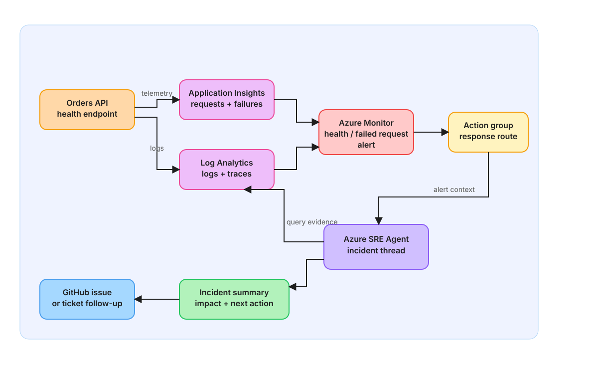

# S4 — Alert Response and Incident Operations

**Persona:** Platform Operations / On-call SRE  
**Time:** ~15 minutes
**Runtime:** Azure App Service
**Infrastructure:** Terraform
**Recipe:** `alert-response-incident-operations` (subagent chain) + `azmon-lawappinsights` (connectors, skills, response plans)

---

## ⚡ Quick Start: 5-Minute Lab

### Prerequisites & Setup

Set your notification email in `infra/terraform/environments/dev.tfvars` and
confirm these scenario values:

```hcl
scenario                       = "s4"
access_level                   = "Low"
action_mode                    = "Review"
webapp_port                    = 8080
enable_app_insights_connector  = true
enable_log_analytics_connector = true
enable_sev01_incident_filter   = true
```

```bash
gh workflow run deploy.yml \
  -f environment=dev \
  -f plan=true \
  -f apply=true

gh run watch

RESOURCE_GROUP="rg-sre-lab-dev"
APP_NAME="$(az webapp list \
  --resource-group "$RESOURCE_GROUP" \
  --query "[?starts_with(name, 'orders-api-')].name | [0]" \
  --output tsv)"
APP_URL="https://$(az webapp show \
  --resource-group "$RESOURCE_GROUP" \
  --name "$APP_NAME" \
  --query defaultHostName \
  --output tsv)"
curl --fail --silent --show-error "$APP_URL/health"
```

### Deploy & Observe (5 mins)
```bash
# Trigger availability failure
curl --fail --silent --show-error \
  -X POST "$APP_URL/api/simulate/failure-rate/100"

for request in {1..30}; do
  curl --silent --output /dev/null \
    --write-out "request $request: HTTP %{http_code}\n" \
    -X POST "$APP_URL/api/orders" \
    -H "Content-Type: application/json" \
    --data '{"customerId":"lab-user","sku":"S4-DEMO","quantity":1}'
done
```

---

## Story

Operator receives an availability alert for the orders-api service. The SRE Agent automatically gathers evidence—failed requests, exceptions, traces, dependencies—and produces a short, evidence-backed incident summary with severity, timeline, owner, and next action. Operator can now confidently escalate or close the loop with exact telemetry.

---

## How It Works

1. **Alert fires** → Azure Monitor detects availability failure
2. **Agent investigates** → Queries Application Insights for requests, exceptions, traces, dependencies
3. **Correlates** → Matches failure window with telemetry patterns
4. **Summarizes** → Produces incident summary with impact, timeline, suspected cause, owner, next action
5. **Operator decides** → Escalate to engineering or close if recovered

### Handoff chain

Steps 2–4 run as the `alert-response-incident-operations` three-agent chain — the
same chain S3 uses, with the AKS triage head swapped for `alert-investigator`:

```text
S3:  aks-triage-agent   -> incident-summary-agent -> incident-comms-agent
S4:  alert-investigator -> incident-summary-agent -> incident-comms-agent
```

`incident-summary-agent` produces the executive summary and status;
`incident-comms-agent` produces the operator-ready update you escalate or close
with. Both carry only `SearchMemory` and are forbidden from remediating, which
matches S4's `access_level = Low` / `action_mode = Review` posture.

`issue-triager` still runs alongside the chain for `[Customer Issue]` GitHub
triage. It depends on the connected repository that `scripts/apply-extras.sh`
registers — see [`config/repos/`](../../recipes/azmon-lawappinsights/config/repos/).

---

## Architecture



---

## Validation Checklist

After the quick start:
- ✅ Azure Monitor alert fires (check Alerts page in portal)
- ✅ SRE Agent investigates automatically
- ✅ Application Insights shows failed requests + exceptions + traces
- ✅ Incident summary generated with evidence links
- ✅ The handoff chain completes in investigate → summary → operator-update order
- ✅ Neither chain agent claims a remediation was performed
- ✅ Operator can confirm recovery state
- ✅ Incident record ready for escalation

---

## Cleanup

```bash
curl --fail --silent --show-error \
  -X POST "$APP_URL/api/simulate/reset"
```

---

## Next: What Comes After S4

- **S5 — PIM Audit**: Compliance and security audit scenarios
- **S6 — Front Door Incident Response**: CDN-layer incident investigation

## Knowledge Base

- [http-500-errors.md](../../knowledge-base/http-500-errors.md)
- [incident-report.md](../../knowledge-base/incident-report.md)
- [on-call-handoff.md](../../knowledge-base/on-call-handoff.md)
- [orders-architecture.md](../../knowledge-base/orders-architecture.md)
