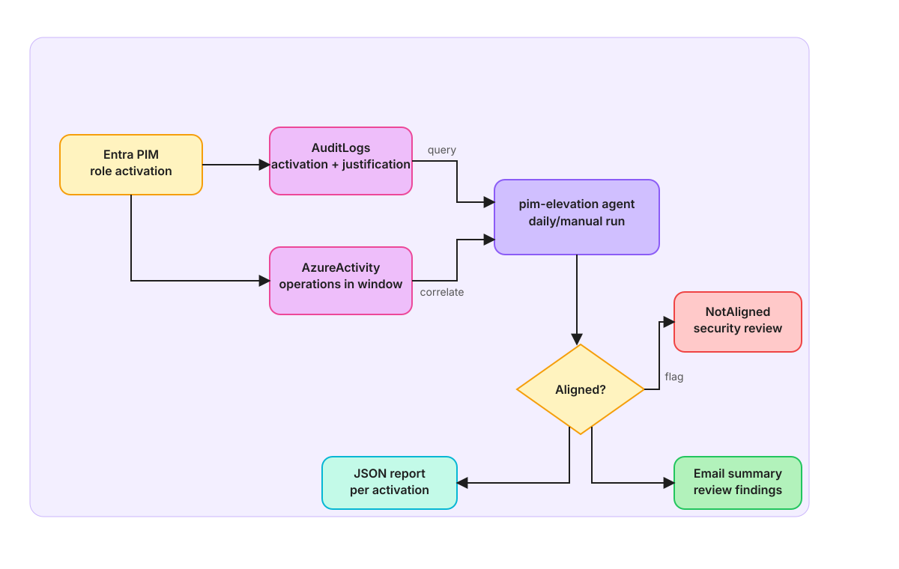

# S5 — PIM Elevation Audit & Alignment

Persona: Security/Compliance Ops  •  Time: ~15 minutes  •  Entry point: Optional add-on

---

## ⚡ Quick Start: 5-Minute Lab (Hands-on)

### Learning Objectives
By completing this lab, you'll:
- Understand automated compliance audit workflows
- See how SRE Agent queries Entra PIM audit logs
- Learn to correlate privileged actions with justification
- Generate compliance reports automatically

### Prerequisites
- Azure subscription with PIM enabled
- Entra AuditLogs exported to Log Analytics workspace
- Azure Activity log exported to the same workspace
- Outlook connector configured for email delivery
- Entra ID Application Administrator or equivalent role

### Exercise: Audit PIM Elevation in 5 Minutes

**Step 1: Configure SRE Agent with PIM automation** (2 mins)
```bash
# Update PIM elevation agent with your Log Analytics details
WORKSPACE_ID=$(az monitor log-analytics workspace show --resource-group <rg> --workspace-name <name> -o tsv --query id)

# Edit the agent configuration
nano recipes/azmon-lawappinsights/agents/pim-elevation-agent.yaml
# Replace: REPLACE_WITH_WORKSPACE_ID with your workspace ID

# Register the agent
az resource create --resource-type Microsoft.App/agents@2025-05-01-preview \
  --name pim-elevation-agent \
  --properties @recipes/azmon-lawappinsights/agents/pim-elevation-agent.yaml

# ✅ Check: Verify agent registered
az resource list --resource-type Microsoft.App/agents@2025-05-01-preview
```

**Step 2: Perform a test PIM elevation** (1 min)
```bash
# Activate a privileged role with clear justification
az rest --method post --url https://graph.microsoft.com/v1.0/roleManagement/directory/roleAssignmentScheduleRequests \
  --body '{
    "principalId": "<user-id>",
    "roleDefinitionId": "<role-id>",
    "action": "selfActivate",
    "justification": "Restore Azure Storage backup for account recovery",
    "scheduleInfo": {
      "startDateTime": "'$(date -u +'%Y-%m-%dT%H:%M:%SZ')'",
      "expiration": {
        "type": "afterDuration",
        "duration": "PT1H"
      }
    }
  }'

# ✅ Check: Verify elevation appears in Entra AuditLogs
az resource list --resource-type Microsoft.AAD/tenants --query "[].id" | xargs -I {} \
  az monitor log-analytics query -w {} --analytics-query "AuditLogs | where OperationName == 'Add member to role' | take 5"
```

**Step 3: Trigger compliance audit** (1 min)
```bash
# Run the PIM elevation agent manually (or wait for daily schedule)
az resource invoke-action --resource-group <rg> \
  --resource-type Microsoft.App/agents@2025-05-01-preview \
  --name pim-elevation-agent \
  --action trigger

# ✅ Check: Watch the agent analyze
# The agent will:
# - Query Entra AuditLogs for PIM activations
# - Extract justification for each elevation
# - Query AzureActivity for actions during elevation window
# - Classify as Aligned/Partial/NotAligned
```

**Step 4: Review compliance report** (1 min)
```bash
# Check the generated compliance artifact
az storage blob list --account-name <storage> \
  --container-name compliance-reports \
  --query "[?contains(name, 'pim-elevation')]"

# ✅ Validation: Verify report contains:
# - User name and role elevated
# - Elevation window (start/end + buffer)
# - Justification text
# - Azure Activity actions captured
# - Classification (Aligned/Partial/NotAligned)
# - Timestamp and auditor info

# Check email inbox for summary (if Outlook connector enabled)
# Expected: Email with audit summary and any flagged misalignments
```

### What You Learned
- Automated PIM compliance audit pattern
- Log correlation across Entra and Azure Activity
- Justification alignment classification
- Report generation and distribution workflows

**Next:** Continue to [S6 — Front Door Incident Response](../s6-frontdoor-incident-response/README.md) for CDN-layer incident scenarios.

---

## Story
A user elevates to a privileged role with a brief justification. The agent runs daily, discovers PIM activations, builds each activation window, correlates actual Azure Activity performed during elevation, and classifies whether actions align with the stated justification. A JSON report and an email summary are produced; misalignment is flagged for review.



---

## How the Agent Handles It
| Step | What happens |
|------|--------------|
| Discover | Query Entra AuditLogs for PIM activation requests/completions and extract justification |
| Window | Construct activation start/end and a ±5m buffer |
| Correlate | Query AzureActivity for operations by the elevated user within each window |
| Classify | Keyword-match justification vs. operations (Aligned/Partial/NotAligned) |
| Report | Emit JSON + plaintext; email summary via connector |

---

## Prerequisites
- Entra PIM enabled; AuditLogs exported to Log Analytics
- Azure Activity exported to the same Log Analytics workspace
- Outlook connector configured for the SRE Agent

---

## Setup
1. Open `recipes/azmon-lawappinsights/agents/pim-elevation-agent.yaml`.
2. Replace:
   - `REPLACE_WITH_WORKSPACE_ID` with your Log Analytics workspace ID
   - `REPLACE_WITH_CONNECTOR_ID` and `REPLACE_WITH_RECIPIENT_EMAILS`
3. Register the agent (portal or API). Example API path used by this repo:
   - `PUT /api/v2/extendedAgent/agents/pim-elevation` with the converted JSON body.

> Tip: Keep this agent disabled in lower environments without PIM logs.

---

## Run & Validate
- Wait for the daily schedule or manually trigger the agent.
- Perform a short PIM elevation with a clear justification (e.g., "restore storage backup").
- Verify:
  - JSON summary artifact present in the agent run
  - Email received with alignment verdict
  - Any NotAligned findings highlighted

---

## Expected Output
- JSON: `runUtc`, analysis window, and per-activation entries (user, role, scope, justification, sample activities, verdict, notes)
- Email: Plaintext rollup with per-activation verdicts; Non-aligned activities called out in the header

---

## Notes
- Extend keyword rules as needed for your environment
- Treat reports as advisory; no remediation actions are performed
