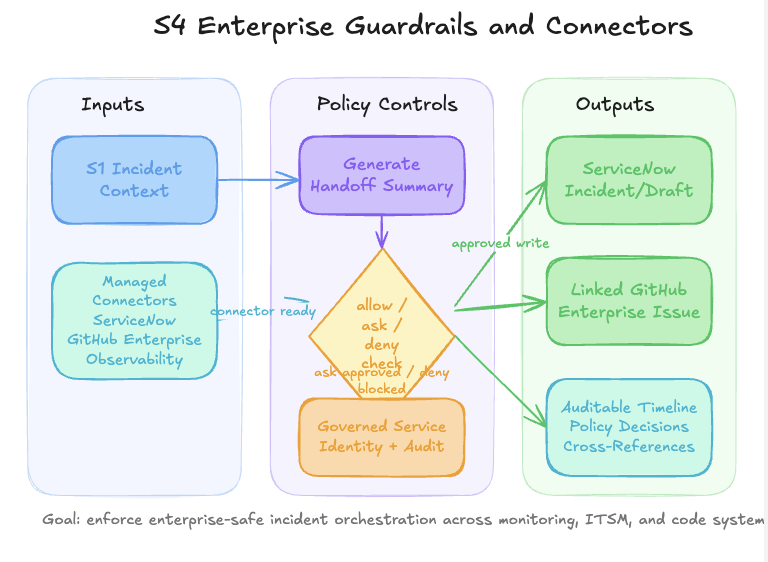

# S6 — Front Door Incident Response

**Persona:** Platform / On-call  
**Time:** ~15 minutes  
**Prerequisite:** S1 infrastructure deployed  
**Recipe:** `azmon-lawappinsights`

---

## ⚡ Quick Start: 5-Minute Lab

### Prerequisites & Setup
```bash
# S1 infrastructure must be running
# Verify Front Door and Container Apps are deployed
az containerapp list --resource-group s1-demo-rg
```

### Deploy & Observe (5 mins)
```bash
# Register S6 incident response automation
bash scripts/apply-extras.sh s6

# Option A: Use Azure Chaos Studio for realistic fault injection
# 1. Create a Chaos Studio experiment to inject latency + failures
az rest --method put \
  --url "https://management.azure.com/subscriptions/$(az account show -o tsv --query id)/resourceGroups/s1-demo-rg/providers/Microsoft.Chaos/experiments/frontdoor-fault-injection?api-version=2023-11-01" \
  --body '{
    "location": "uksouth",
    "properties": {
      "steps": [
        {
          "name": "Inject latency and errors",
          "branches": [
            {
              "name": "Inject",
              "actions": [
                {
                  "type": "continuous",
                  "name": "urn:provider:Microsoft.ContainerApps:fault-injection:injectLatencyFault",
                  "duration": "PT5M",
                  "parameters": [
                    { "key": "latency", "value": "5000" },
                    { "key": "errorRate", "value": "50" }
                  ],
                  "targets": [
                    { "type": "Microsoft.ContainerApps/containerApps", "id": "/subscriptions/$(az account show -o tsv --query id)/resourceGroups/s1-demo-rg/providers/Microsoft.App/containerApps/orders-api" }
                  ]
                }
              ]
            }
          ]
        }
      ],
      "selectors": []
    }
  }'

# 2. Run the experiment
az rest --method post \
  --url "https://management.azure.com/subscriptions/$(az account show -o tsv --query id)/resourceGroups/s1-demo-rg/providers/Microsoft.Chaos/experiments/frontdoor-fault-injection/start?api-version=2023-11-01"

# Option B: Simple manual scale (if Chaos Studio not configured)
az containerapp scale \
  --resource-group s1-demo-rg \
  --name orders-api \
  --target 0

# Watch it auto-respond:
# - Azure Monitor alert fires (30–60 sec)
# - SRE Agent investigates via Application Insights + Front Door metrics
# - Identifies routing/latency/error spike
# - Proposes remediation (scale up, drain unhealthy backends, update routing rule)
# - Executes fix (or waits for approval)
# - Service recovers and Front Door routes traffic to healthy replicas

# Cleanup: Stop the Chaos Studio experiment
az rest --method post \
  --url "https://management.azure.com/subscriptions/$(az account show -o tsv --query id)/resourceGroups/s1-demo-rg/providers/Microsoft.Chaos/experiments/frontdoor-fault-injection/stop?api-version=2023-11-01"

# OR manually restore replicas
az containerapp scale \
  --resource-group s1-demo-rg \
  --name orders-api \
  --target 3
```

---

## Story

A Platform team runs a Chaos Studio experiment to test resilience: inject latency and failure rates into the orders-api service, simulating degraded backend health. Front Door's health probes detect the issues and mark backends as unhealthy. Traffic reroutes to healthy replicas, but error rates spike. The SRE Agent automatically detects the spike, investigates via Application Insights and Front Door metrics, diagnoses the multi-layer issue, and proposes remediation. Traffic is restored before customer impact escalates.

---

## How It Works

1. **Chaos Studio injects faults** → Adds latency (5s) + 50% error rate to Container App
2. **Alert fires** → Azure Monitor detects 5xx spike at Front Door
3. **Agent investigates** → Queries Application Insights + Front Door health probe metrics
4. **Diagnoses** → Correlates error spike with backend degradation
5. **Proposes fix** → Scale up, drain unhealthy backends, or adjust retry policies
6. **Executes** → Auto-fix (or wait for human approval); experiment stops automatically

---

## Architecture



---

## Validation Checklist

After the quick start:
- ✅ Azure Monitor alert fires (check Alerts page in portal)
- ✅ SRE Agent investigates automatically
- ✅ Application Insights shows 502/503 spike + recovery
- ✅ Front Door health probe metrics show failure → recovery
- ✅ Container Apps replicas scale back to 3
- ✅ Error rate drops to baseline

---

## Cleanup

```bash
# Restore replicas if needed
az containerapp scale \
  --resource-group s1-demo-rg \
  --name orders-api \
  --target 3
```

---

## Next: What Comes After S6

**You've completed all 6 scenarios!**
- S1–S2 cover core incident detection and autonomous remediation
- S3 covers AKS root cause investigation with ServiceNow
- S4 covers operator workflows
- S5 covers compliance auditing
- S6 covers CDN-layer incident response

---

## Knowledge Base

- [http-502-errors.md](../../knowledge-base/http-502-errors.md)
- [frontdoor-architecture.md](../../knowledge-base/frontdoor-architecture.md)
- [incident-report.md](../../knowledge-base/incident-report.md)
